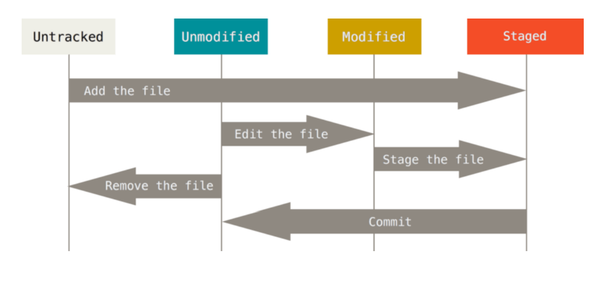

# Git 정리

## Git 이란?

> **분산 버전 관리 시스템**

## Git 기본 명령어

- `$ cd`

  Change Directory, 디렉토리 이동

  - cd ..

    상위 디렉토리로 이동

  - cd a (a directory가 있을 시)

    a 디렉토리로 이동

    

- `$ mkdir a`

  a 디렉토리 생성

- `$ touch b.txt`

  b.txt 파일 생성

- `$ rmdir a` || `$ rm -r a`

  a 디렉토리 삭제

  

- `$ rm b.txt`

  b.txt 파일 삭제
  
  
  
  ---

- `$ git config`

  - `$ git config --global user.name '유저 닉네임'` 

  - `$ git config --global user.email '유저 이메일'`

    사용자 정보를 받는다.

    컴퓨터에 한 번만 입력시켜주면 된다.

    

- `$ git init`

  현재 디렉토리를 Git 저장소로 만들어 Git으로 관리한다.

  하위 디렉토리로 .git이 생성된다.

  git init 명령을 성공하면 경로 뒤에 (master)이 뜬다.

   

- **`$ git add 파일명`**

  현재 작업공간의 파일들을 staging area로 모은다.

  - `$ git add .`

    현재 작업공간의 모든 파일들을 staging area로 모은다.

  

- **`$ git status`**

  Working Directory와 Staging Area의 현재 상태를 보여준다.

  윈도우에서는 add 되지 않은 파일은 **빨간색**, add 되어 Staging Area로 이동된 파일은 **초록색**으로 나타난다.

  

  

- **`$ git commit -m '커밋 메시지'`**

  Staging Area의 모든 파일들을 Repository로 이동시킨다. 이때 **버전들이 기록된다.**

  -m 옵션은 커밋 메시지를 기록할 수 있는 옵션으로, 어떤 변경사항들이 있었는지 명확하게 작성해야 한다.

  commit 마다 40자 길이의 Check Sum을 생성하여 고유한 커밋을 표기한다.

  

- **`$ git log`**

  현재 commit 되어 남겨진 버전들을 나열해준다.

  - `$ git log -1`

    -1 옵션은 최근 1개의 버전을 보여준다.

  - `$ git log --oneline`

    --oneline 옵션은 모든 버전들을 한 줄로 간략하게 보여준다.

  - `$ git log -2 --oneline`

    최근 2개의 버전들을 한 줄로 간략하게 보여준다.

## Git 기본 구성과 흐름

Git은 Working Directory, Staging Area, Repository로 이루어져있다.

- Working Directory

  말 그대로 작업 공간

- Staging Area

  버전으로 기록하기 위해 add 시켜놓은 파일 변경사항의 목록 (commit 하기 전 임시 저장공간)

- Repository

  commit(버전)들이 기록되는 공간

> **Working Directory** ===*add*==>> **Staging Area** ===*commit*==>> **Repository** (버전 기록)

## 파일 라이프사이클

> [이미지 출처](https://git-scm.com/book/ko/v2/Git의-기초-수정하고-저장소에-저장하기)

- Untracked: Git에 추적이 안된 파일, 한번도 add되지 않은 파일
- Unmodified: commit 된 적은 있으나 수정되지 않은 파일, **Repository의 파일**
- Modified: 수정된 파일
- Staged: add된 파일, commit 하기 직전 단계, **Staging Area의 파일**

---

- Untracked인 파일을 `add`하면 Staged 상태가 된다.

- Unmodified인 파일을 수정하면 Modified 상태가 된다.

- Modified인 파일을 `add`하면 Staged 상태가 된다.

- Staged인 파일을 `commit`하면 Unmodified 상태가 된다.

