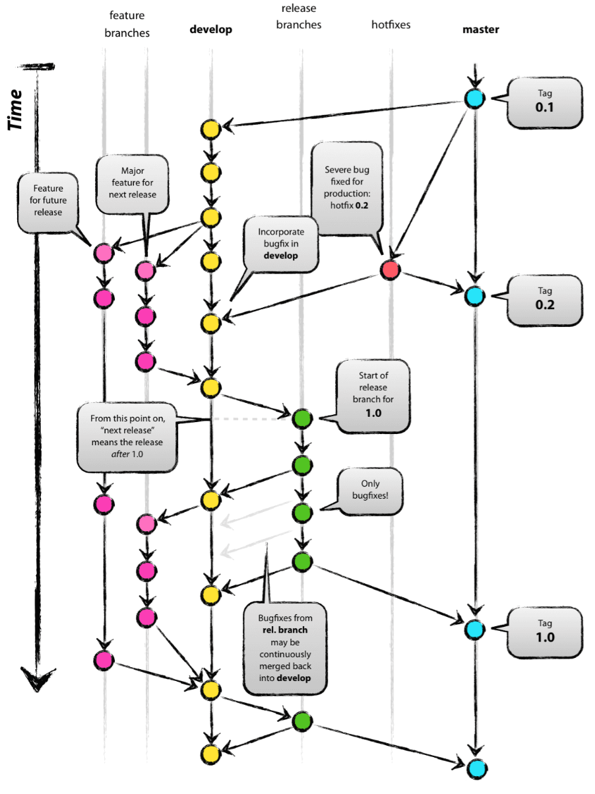
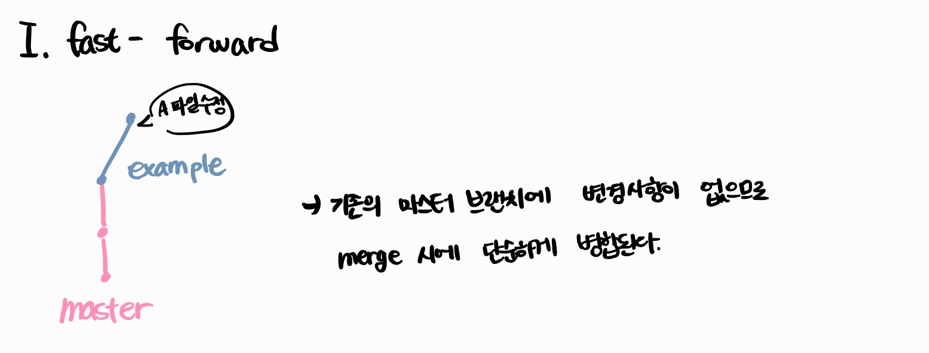
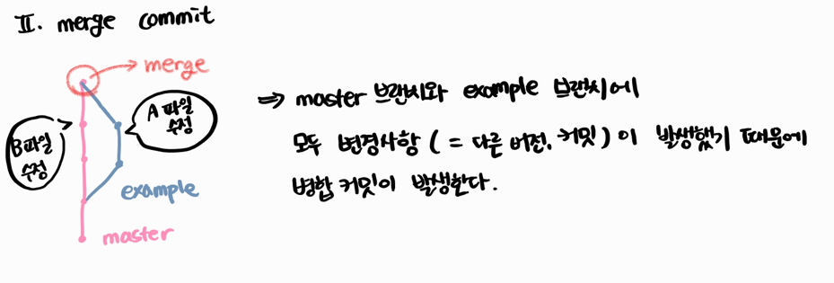
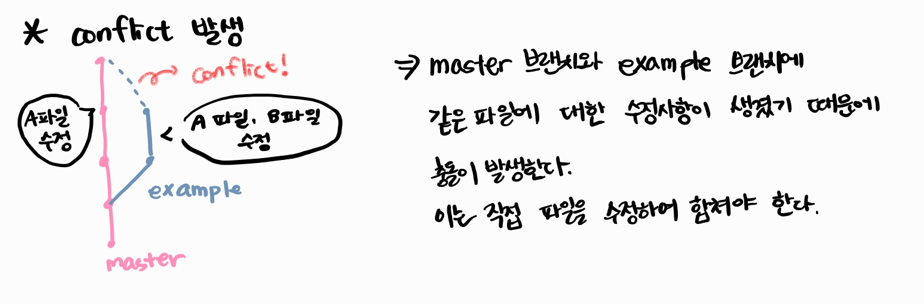

# Git Branch

> branch 사용 이유: 여러 사람이 **협업**할 때 **독립적으로** 프로그래밍을 하기 위하여

## Git Flow

> Git을 활용하여 협업하는 흐름 (Branch를 활용하는 전략)
>
> 정해진 답이 있는 것은 아니고 각 프로젝트, 회사에 맞는 흐름으로 변형되어 활용한다

### 대표적인 Git Flow 전략

|            Branch             |                          주요 특징                           |               예시               |
| :---------------------------: | :----------------------------------------------------------: | :------------------------------: |
|         master (main)         |                   배포 가능한 상태의 코드                    |    LOL 클라이언트 라이브 버전    |
|        develop (main)         | feature branch로 나뉘어지거나 발생된 버그 수정 등 개발/ 개발 이후 release branch로 갈라짐 |      다음 패치를 위한 개발       |
| feature branches (supporting) | 기능별 개발 브랜치(topic branch)/ 기능이 반영되거나 드랍되는 경우 삭제 | 신규챔피언 닐라, 드래곤 업데이트 |
| release branches (supporting) | 개발 완료 이후 QA, Test 등을 통해 얻어진 다음 배포 전 이루어져야할 bug fix 반영 (다음 버전을 위함) |         9.24a, 9.24b ...         |
|     hotfixes (supporting)     |      긴급하게 반영 해야하는 bug fix (현재 버전을 위함)       |      긴급 패치를 위한 작업       |



이미지 출처: https://techblog.woowahan.com/2553/


## Branch 기본 명령어

- `(master) $ git branch <branch name>`
  - 브랜치를 생성한다
- `(master) $ git checkout <branch name>`
  - 해당 브랜치로 이동한다
- `(master) $ git checkout -b <branch name>`
  - `-b`옵션을 사용하여 브랜치 생성과 이동을 동시에 한다
- `(master) $ git merge <branch name>`
  - master 브랜치에 <branch name> 브랜치 합치기

- `(master) $ git branch -d <branch name>`
  - 브랜치를 삭제한다
  - master 브랜치에 이미 병합된 브랜치는 더이상 쓸모가 없으므로 삭제한다
- `(master) $ git branch`
  - 브랜치 목록을 조회한다


## Branch Merge

각 브랜치에서 작업한 이력을 합치려면 merge 명령어를 사용한다.

- ### fast-forward

  - 기존 master 브랜치에 변경사항이 없어서 단순히 앞으로 이동만 한다.


- ### merge commit

  - 기존 master 브랜치와 병합하길 원하는 브랜치 모두에 변경사항이 있기 때문에 병합 커밋이 발생한다.

- ### *Conflict 발생

  - 기존 master 브랜치와 병합하길 원하는 브랜치에 같은 파일에 대한 수정사항이 있어서 conflict가 발생하며, 이는 수작업으로 해결해야한다.
  
  - 위와 같은 상황에서 A파일을 열어보면 다음과 같이 되어있다.
  - ```
    # Git 명령어
    add: 변경 사항을 만들어서 인덱스에 등록해보기
    <<<<<<< HEAD
    commit: 인덱스의 상태를 기록하기
    =======
    pull: 원격 저장소의 내용을 가져오기
    >>>>>>> example
    ```
    
  - 이때, `<<<< HEAD`는 master 브랜치에서 수정된 내용이고 `>>>> example`은 example 브랜치에서 수정된 내용이다. 이렇게 Git이 자동으로 어떤 브랜치에서 어떤 부분이 충돌되었는지 알려주므로 이를 바탕으로 파일을 수정하여 다시 `add`, `commit` 하면 된다.


## GitHub Flow 기본 원칙

1. master branch는 반드시 배포 가능한 상태여야 한다.
2. feature branch는 각 기능의 의도를 알 수 있도록 작성한다.
3. Commit message는 매우 중요하며, 명확하게 작성한다.
4. Pull Request를 통해 협업을 진행한다.
5. 변경사항을 반영하고 싶다면, master branch에 병합한다.


## Workflow

- ### Feature Branch Workflow: 원격저장소에 소유권 있는 경우

  1. `$ git clone <URL>`
     - 원격저장소를 로컬저장소로 clone 한다.
  2. `$ git checkout -b hotfix`
     - 새로운 branch(ex. hotfix)를 만들어 원하는 작업을 한다.
  3. `$ git add .`
  4. `$ git commit -m '커밋메시지'`
  5. `$ git push origin hotfix`
     - 새로 만든 branch를 원격저장소에 push 한다.
  6. 원격저장소에 들어가서 `Pull request`를 진행한다.
  7. master branch에 새로운 branch를 병합한다.
  8. `$ git pull origin master`
     - 병합된 master의 내용을 다시 로컬 저장소에 pull로 받아온다.
  9. `$ git branch -d hotfix`
     - 병합된 branch는 삭제한다.
  10. 위의 내용을 반복하며 협업을 해나간다.


- ### Forking Workflow(Fork and Pull request): 원격저장소에 소유권이 없는 경우

  1. 소유권이 없는 원격저장소를 `fork`로 내 레포지토리에 가지고 온다.
  2. `$ git clone URL`
     - `fork`를 떠온 프로젝트를 가지고 로컬저장소에 clone한다.

3. `$ git checkout -b hotfix`
   - 새로운 branch를 만들어 원하는 작업을 한다.
4.  `$ git add .`
5. `$ git commit -m '커밋메시지'`
6. `$ git push origin hotfix`
7. 원본 원격저장소의 master branch로 `Pull request`를 진행한다.
   - 원격저장소에 권한이 없기 때문에 merge는 내가 진행하지 못한다.
8. `$ git pull upstream master`
   - 원본의 원격저장소(upstream)를 pull 해온다.
9. `$ git branch -d hotfix`
   - 병합이 완료된 로컬 branch 삭제한다.
10. 위의 내용을 반복하며 협업을 해나간다.


**두 모델의 가장 큰 차이점: 내가 해당 프로젝트 저장소에 직접적인 push 권한의 여부!**


## 참고하면 좋은 자료들

- [우아한 형제들 기술블로그 - 우린 GitFlow를 사용하고 있어요](https://techblog.woowahan.com/2553/)

