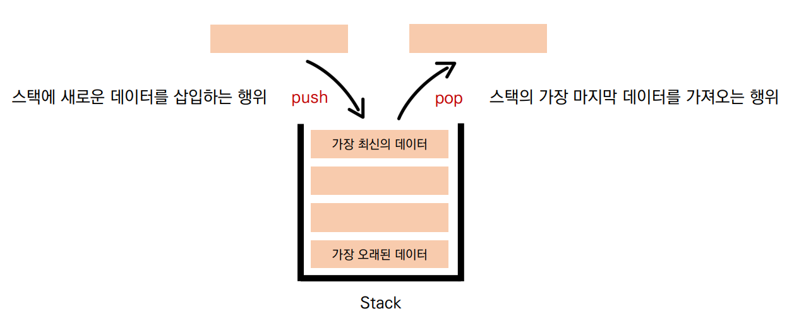
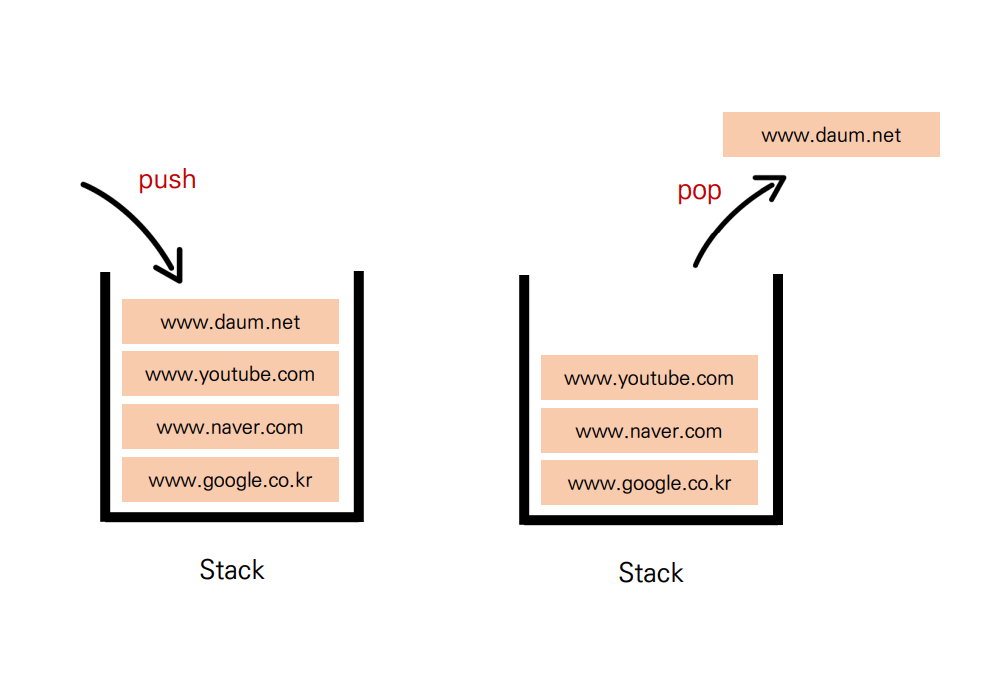
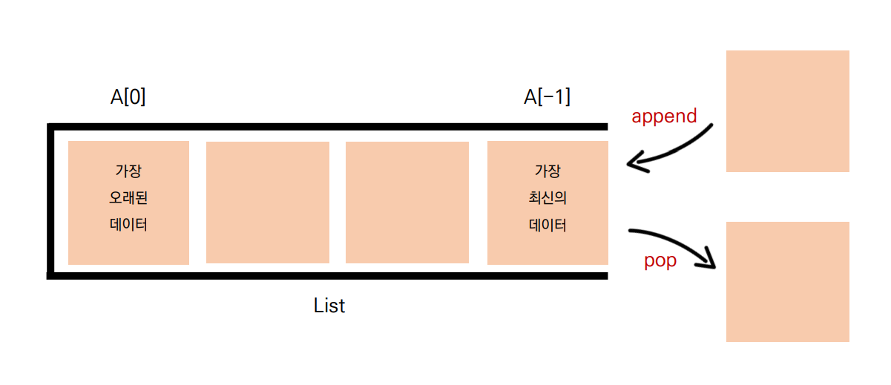
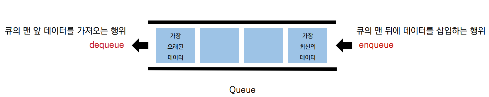
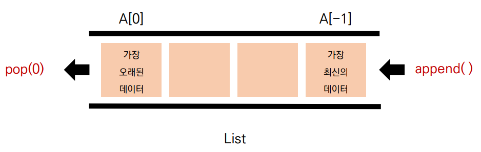
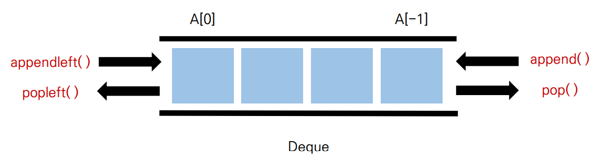

# 스택 (Stack)
> 데이터를 한쪽에서만 넣고 빼는 자료구조
> 가장 마지막에 들어온 데이터가 가장 먼저나가는 LIFO(Last-in First-out, 후입선출) 방식

## 스택 자료구조의 대표 동작
- `push`: 스택에 새로운 데이터를 삽입하는 행위
- `pop`: 스택의 가장 마지막 데이터를 가져오는 행위



## 스택을 사용하는 이유
### 1. 뒤집기, 되돌리기, 되돌아가기
- **브라우저 히스토리**
        브라우저에서 여러 웹 사이트를 돌아다니다가 *뒤로가기*를 누르면 바로 이전 창이 뜬다.
        스택에 웹 사이트를 들어갈 때마다 push를 하고 뒤로가기 버튼을 누르면 pop하여 이전 창이 뜨게 할 수 있다.
    

- **ctrl + z**
        이와 똑같이 어떠한 작업을 하다가 `ctrl + z`를 하면 바로 이전의 작업으로 복구할 수 있는 것도 이러한 스택의 특성을 활용한 것이다.
- **단어 뒤집기**
        어떤 단어를 반대로 뒤집는 것도 스택을 이용할 수 있다.
        원래의 단어의 글자를 하나하나 스택에 push하여 넣은 후에 모두 pop하면 단어가 뒤집혀서 나온다.
    
### 2. 마무리 되지 않은 일을 임시 저장
- **괄호 매칭**
        괄호가 모두 제대로 매칭이 되었는지를 알기 위해서 *스택에 여는 괄호가 나오면 push, 닫는 괄호가 나오면 pop*을 하여 마지막까지 모두 읽었을 때 스택의 길이가 0이라면 올바른 괄호 매칭이라고 할 수 있다.
        단, 이때 닫는 괄호가 나와서 pop을 할 때 스택에 아무것도 없다면 그것은 틀린 괄호 매칭이므로 조건문을 달아줘야 한다.
    
- **함수 호출(재귀 호출)**
        예를 들어 `print(sum(max(min(2, 5), 10), min(2, 5)))`라는 코드가 있다면 `print()`함수는 제일 먼저 불려와서 시작은 했지만 바로 끝낼 수 없다.
        이럴 때에 호출되어서 시작된 함수들을 순서대로 스택에 push하고, 만약 함수가 끝이 난다면 pop을 하는 방식을 사용하여 함수 호출을 제대로 할 수 있다.
- **백트래킹**
        미로 찾기나 체스 게임에 활용되는 백트래킹은 먼저 시도를 해봤다가 아니면 돌아가는 방식으로 동작한다.
        이때 스택을 이용하여 행동들을 push로 저장하고 만약 틀린 결과가 나온다면 다시 pop을 하여 돌아가는 방식으로 작동할 수 있다.
- **DFS(깊이 우선 탐색)**

## 파이썬에서의 스택: 리스트
> 파이썬은 **리스트**를 이용하여 스택을 간편하게 사용할 수 있다.
- `.append()`: 스택의 push와 같은 기능을 하는 메소드다. 리스트의 마지막에 새로운 요소를 삽입한다.
- `.pop()`: 스택의 pop과 같은 기능을 하는 메소드다. 리스트의 마지막 요소를 삭제하고 반환한다.



# 큐 (Queue)
> 한 쪽 끝에서 데이터를 넣고, 다른 한 쪽에서만 데이터를 뺄 수 있는 자료구조
> 가장 먼저 들어온 데이터가 가장 먼저 나가는 FIFO(First-in First-out, 선입선출) 방식

## 큐 자료구조의 대표 동작
- `enqueue`: 큐의 맨 뒤에 데이터를 삽입하는 행위
- `dequeue`: 큐의 맨 앞 데이터를 가져오는 행위

## 파이썬에서의 큐: 리스트
> 파이썬은 큐 자료구조도 **리스트**를 이용하여 간편하게 사용할 수 있다.
- `append()`: 큐의 enqueue 역할을 하는 메소드로, 리스트의 마지막에 새로운 데이터를 삽입한다.
- `pop(0)`: 큐의 dequeue 역할을 하는 메소드로, 리스트 인덱스 0 에 있는 데이터(가장 오래된 데이터, 리스트의 가장 앞에 위치한 데이터)를 삭제하고 반환한다.


## 리스트를 이용한 큐 자료구조의 단점
> **데이터를 뺄 때** 큐 안에 있는 데이터가 많은 경우 **비효율적**이다.
> 맨 앞 데이터가 빠지면서, 리스트의 인덱스가 하나씩 당겨지기 때문이다. -> 시간이 많이 걸림

# 덱 (Deque, Double-Ended Queue)
> 큐 자료구조의 단점을 보완한 자료구조
> **양 방향**으로 삽입과 삭제가 자유롭다!!
> 양 방향 삽입, 추출이 모두 큐보다 훨씬 빠르다.
> 따라서 데이터의 삽입, 추출이 많은 경우, 시간을 크게 **단축**시켜 효율적이다.

## pop(0) VS popleft()
- 리스트의 `pop()`은 마지막 값을 꺼내는 경우 **O(1)의 시간복잡도**를 가지지만,
    `pop(0)`으로 첫번째의 데이터를 꺼낼 때는 값을 삭제한 후 뒤에 있는 데이터들의 인덱스를 하나씩 앞당겨야 하므로 **O(n)**의 시간복잡도를 갖는다.
- 하지만 deque를 사용할 경우 `popleft()`를 하면 **O(1)의 시간복잡도**를 갖는다.

## 덱 자료구조의 대표 동작
- `appendleft()`: 왼쪽에 데이터를 삽입한다.
- `popleft()`: 왼쪽 데이터를 삭제한다.
- `append()`: 오른쪽에 데이터를 삽입한다.
- `pop()`: 오른쪽 데이터를 삭제한다.

## 큐와 덱 풀이 비교
[BOJ 2161번 카드1]((https://www.acmicpc.net/problem/2161))
- 문제
        1부터 N까지의 카드가 있다. 1번 카드가 제일 위에, N번 카드가 제일 아래인 상태로 순서대로 카드가 놓여 있다.
        제일 위에 있는 카드를 바닥에 버리고 제일 위에 있는 카드를 제일 아래에 있는 카드 밑으로 옮긴다.
        이 동작을 카드가 한 장 남을 때까지 반복한다.
        N이 주어졌을 때, 버린 카드들을 순서대로 출력하고, 마지막에 남게 되는 카드를 출력하는 프로그램을 작성하시오.
        
- 입력
        첫째 줄에 정수 N(1 ≤ N ≤ 1,000)이 주어진다.
- 출력
        첫째 줄에 버리는 카드들을 순서대로 출력한다. 제일 마지막에는 남게 되는 카드의 번호를 출력한다.
        
### 큐를 이용한 풀이
- `pop(0)`을 이용하여 왼쪽의 데이터(가장 오래된 데이터)를 빼서 오른쪽에 `append`해준다.
```python
N = int(input())
queue = list(range(1, n + 1))

while len(queue) > 1:
    print(queue.pop(0), end=' ')    # 버리는 카드는 바로 출력한다.
    queue.append(queue.pop(0))      # pop(0)을 이용하여 가장 아래의 카드를 빼서 append 해준다.
    
print(queue[0])
```


### 덱을 이용한 풀이
- 덱을 사용하기 위해서 `from collections import deque`를 작성하여 불러온다.
- `popleft`를 이용하여 왼쪽의 데이터(가장 오래된 데이터)를 빼서 오른쪽에 `append`해준다.
```python
from collections import deque

N = int(input())
card = deque(range(1, N+1))

while len(card) > 1:
    print(card.popleft(), end=' ')    # 버리는 카드는 바로 출력한다.
    card.append(card.popleft())       # popleft를 이용하여 카드덱의 가장 아래에서 뺀 카드를 바로 append 해준다.

print(card[0])
```