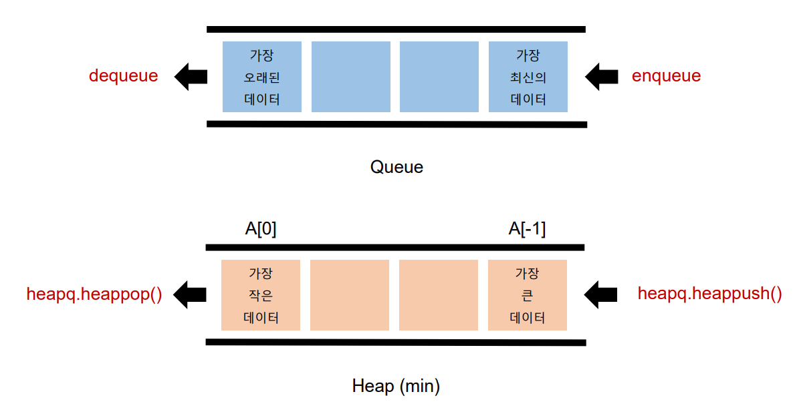

# 우선순위 큐 (Priority Queue)
> 일반적인 큐는 들어온 **순서를 기준으로** 선입선출하는 방식이다
> 만약 큐를 순서가 아닌 다른 기준으로 내보내려면 우선 순위 큐를 이용한다.
> 우선순위 큐는 순서가 아닌 **우선순위를 기준으로** 가져올 요소를 결정(dequeue)하는 큐로 가장 우선순위가 높은 데이터가 가장 먼저 나가는 방식이다.


## 우선순위 큐가 쓰이는 상황
- **가중치가 있는 데이터**
        가중치에 따라 데이터를 먼저 내보내고 싶을 때 사용할 수 있다.
- **작업 스케줄링**
        예를 들어 컴퓨터에 크롬을 먼저 키고 나중에 롤을 키고 게임을 한다면 순서는 크롬이 먼저지만 롤을 하는 것에 더욱 비중을 두어 리소스를 돌리는 상황 등이 있다.
 - **네트워크**
         메시지의 중요도를 판단하지 않고 순서대로 다 통과시켜버리면 네트워크 운영이 제대로 되지 않을 수도 있다.
         이럴 때 우선 순위 큐를 사용할 수 있다.
         
 
## 우선순위 큐를 구현하는  방법
> 우선순위 큐를 구현하는 방법에는 배열, 연결리스트, 힙이 있다.
> 이중에서 시간 복잡도를 따졌을 때 가장 효율적인 구현 방법은 **힙(Heap)** 이다.

| 연산 종류              | Enqueue(추가) | Dequeue(삭제) |
|:------------------:|:-----------:|:-----------:|
| 배열(Array)          | O(1)        | O(N)        |
| 정렬된 배열             | O(N)        | O(1)        |
| 연결리스트(Linked List) | O(1)        | O(N)        |
| 정렬된 연결리스트          | O(N)        | O(1)        |
| 힙(Heap)            | O(logN)     | O(logN)     |

# 힙(Heap)
> 최댓값 또는 최솟값을 빠르게 찾아내도록 만들어진 데이터구조
> 완전 이진 트리의 형태로 **느슨한 정렬 상태를 지속적으로 유지**한다.
> 힙 트리에서는 중복 값을 허용한다.

## 힙이 사용되는 상황
- 데이터가 지속적으로 정렬돼야 하는 경우
- 데이터에 삽입/ 삭제가 빈번할 때

## 파이썬의 heapq 모듈
> Minheap(최소 힙)으로 구현되어 있다. (가장 작은 값이 먼저 옴)
> 삽입, 삭제, 수정, 조회 **연산의 속도가 리스트보다 빠르다.**

## 힙과 리스트 비교
> 힙이 시간복잡도 측면에서 유리하다!

| 연산 종류        | 힙(Heap) | 리스트(List)    |
|:------------:|:-------:|:------------:|
| Get Item     | O(1)    | O(1)         |
| Insert Item  | O(logN) | O(1) 또는 O(N) |
| Delete Item  | O(logN) | O(1) 또는 O(N) |
| ISearch Item | O(N)    |              |

## 큐와 힙의 사용법 비교
> 큐는 삽입 `enqueue`, 삭제 `dequeue`
> 힙은 삽입 `heapq.heappush()`, 삭제 `heapq.heappop()`

## 힙의 메소드
### heapq.heapify(iterable)
> distructive 메소드로, 리턴값이 없이 인자로 받은 iterable의 원본을 변환해준다.
> `.heapify`를 해주면 가장 작은 값이 맨 앞으로 간다. (최소힙의 경우)
```python
import heapq

numbers = [5, 4, 3, 2, 1]
heapq.heapify(numbers)

print(numbers)
# [1, 3, 2, 4, 5]
```
### heapq.heappop(heap)
> min heap의 경우 가장 작은 데이터가 삭제, 반환된다.
```python
import heapq

numbers = [5, 4, 3, 2, 1]
heapq.heapify(numbers)
heapq.heappop(numbers)

print(numbers)
# [2, 3, 4, 5]
```
이때 중요한 점은` heappop(numbers)`으로 맨 앞에 있는 1을 꺼내면 numbers가 [3, 2, 4, 5]가 되는 것이 아닌 [2, 3, 4, 5]가 되는 것을 볼 수 있다.
따라서 min heap에서 맨 앞의 값이 pop되고 나면 다시 제일 작은 값을 찾아 맨 앞으로 정렬한다.

### heapq.heappush(heap, item)
> min heap의 경우 맨 뒤에 데이터를 삽입하는데, 이때 **가장 작은 데이터일 경우 느슨한 정렬이 다시 유지되며 맨 앞에 삽입된다.**
```ppython
import heapq

numbers = [5, 4, 3, 2, 1]
heapq.heapify(numbers)
heapq.heappop(numbers)
heapq.heappush(10)
heapq.heappush(0)
;
print(numbers)
```

# 셋 (Set)
> 셋은 수학에서의 집합을 나타내는 데이터 구조로 Python에서는 기본적으로 제공되는 데이터 구조이다.

## 셋의 메소드와 연산
### 추가
- `.add(요소)`
    - 셋에 요소를 추가한다.
- `.update([요소들])`
    - 여러 원소를 한번에 추가할 때 사용한다.
    - ex) `set_.update([10, 20, 'python'])`: set_에 10, 20, 'python'을 한번에 추가함

### 삭제
- `.remove(요소)`
    - 셋에 있는 요소를 제거한다.
    - 만약 요소가 셋에 포함되어 있지 않으면 KeyError를 발생시킨다.
- `.discard(요소)`
    - 요소가 셋에 있으면 요소를 제거한다.
    - 셋에 요소가 포함되어 있지 않더라도 KeyError이 발생하지 않는다.
- `.clear()`
    - 셋에 있는 모든 요소를 제거한다.

### 연산자
- 합집합: OR, 서로 다른 두 set을 합쳐준다.
    - `+`
    - `.union(다른 셋)`
```python
set1 = set([1, 2, 3, 4, 5])
set2 = set([3, 4, 5, 6, 7])
print(set1 + set2)
# {1, 2, 3, 4, 5, 6, 7}
```

- 교집합: AND, set1에서 set2와 겹치는 값만 남겨둔다.
    - `&`
    - `.intersection(다른 셋)
```python
set1 = set([1, 2, 3, 4, 5])
set2 = set([3, 4, 5, 6, 7])
print(set1 & set2)
# {3, 4, 5}
```

- 차집합: set1에서 set2의 요소를 뺀다.
    - `-`
    - `.difference(다른 셋)`
```python
set1 = set([1, 2, 3, 4, 5])
set2 = set([3, 4, 5, 6, 7])
print(set1 - set2)
# {1, 2}
```

- 대칭차집합: XOR, 합집합 - 교집합, 두 값이 다를 경우에만 참이다. 합집합에서 값이 같은 교집합을 뺀다.
    - `^`
    - `.symmetric_difference(다른 셋)`
```python
set1 = set([1, 2, 3, 4, 5])
set2 = set([3, 4, 5, 6, 7])
print(set1 ^ set2)
# {1, 2, 6, 7}
```

## Set이 사용되는 상황
- 데이터의 중복이 없어야 할 때 (고유값들로 이루어진 데이터가 필요할 때)
- 정수가 아닌 데이터의 삽입, 삭제, 탐색이 빈번히 필요할 때

## 셋 연산의 시간 복잡도

| 연산 종류  | 시간 복잡도 |
|:------:|:------:|
| 탐색     | O(1)   |
| 제거     | O(1)   |
| 합집합    | O(N)   |
| 교집합    | O(N)   |
| 차집합    | O(N)   |
| 대칭 차집합 |        |