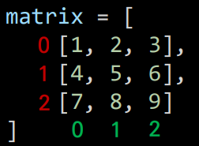
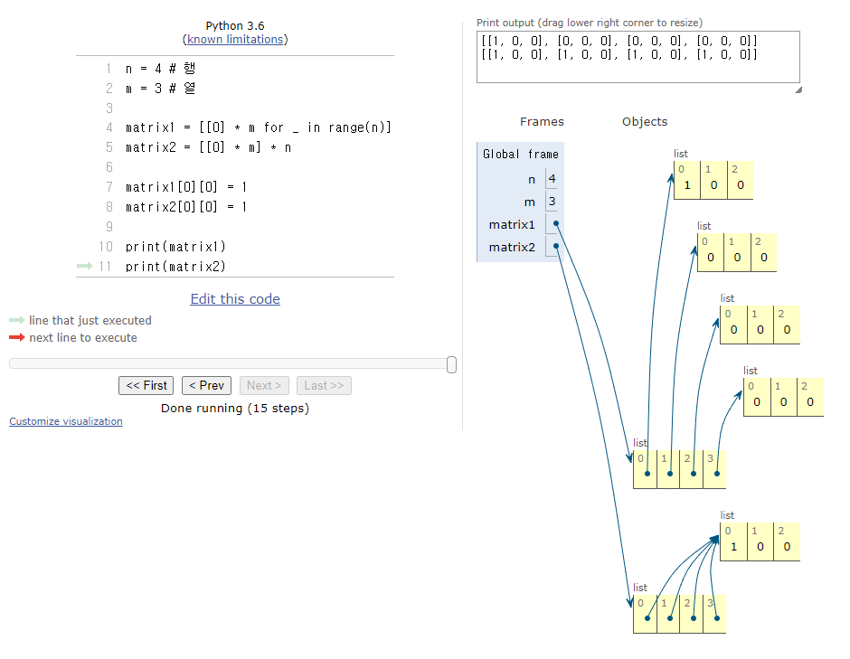

# 이차원 리스트
> 리스트를 원소로 가지는 리스트
> 원소인 리스트들을 세로로 보기 좋게 나열하면 **행렬**의 형태가 나온다.
```python
matrix = [[1, 2, 3], [4, 5, 6], [7, 8, 9]]
```
```python
matrix = [
    [1, 2, 3],
    [4, 5, 6],
    [7, 8, 9]
]
```
> 이차원 리스트는 **행렬**이다.
> 아래에서 6을 찾는다면 (1, 2)위치에 있다고 할 수 있다.


## 이차원 리스트 특정 값으로 초기화하기
### 반복문으로 작성 (100 x 100 행렬)
```python
matrix = []

for _ in range(100):
    matrix.append([0] * 100)
```
### 반복문으로 작성 (n x m 행렬)
```python
matrix = []

for _ in range(n):
    matrix.append([0] * m)
```
### 리스트 컴프리헨션으로 작성 (n x m 행렬)
```python
matrix = [[0] * m for _ in range(n)]
```
### ⚠주의⚠ 리스트 컴프리헨션 vs 리스트 곱셈 연산
> 곱하기 연산을 사용하면 과연 리스트 컴프리헨션을 사용했을 때와 결과가 같을까??
아래만 본다면 matrix1과 matrix2가 차이가 없다고 생각할 수 있다.
```python
n = 4 # 행
m = 3 # 열

matrix1 = [[0] * m for _ in range(n)]
matrix2 = [[0] * m] * n

print(matrix1)
>>> [[0, 0, 0], [0, 0, 0], [0, 0, 0], [0, 0, 0]]
print(matrix2)
>>> [[0, 0, 0], [0, 0, 0], [0, 0, 0], [0, 0, 0]]
```

하지만 matrix1과 matrix2의 원소값을 각각 변경하게 되면 아래 결과처럼 다르다.
```python
n = 4 # 행
m = 3 # 열

matrix1 = [[0] * m for _ in range(n)]
matrix2 = [[0] * m] * n

matrix1[0][0] = 1
matrix2[0][0] = 1

print(matrix1)
>>> [[1, 0, 0], [0, 0, 0], [0, 0, 0], [0, 0, 0]]
print(matrix2)
>>> [[1, 0, 0], [1, 0, 0], [1, 0, 0], [1, 0, 0]]
```

이러한 현상이 일어난 이유는 무엇일까?
파이썬 튜터를 이용하여 알아보자.
리스트 컴프리헨션을 이용한 matrix1은 포인터가 각각의 원소를 가리킨다. 즉 **원소마다 주소값이 다 다르다.**
리스트 곱셈 연산을 이용한 matrix2는 모든 리스트의 원소의 포인터가 같은 `[1, 0, 0]` 리스트를 가리키기 때문에 `[0][0]`값만 변경하여도 모든 [0]번째 인덱스의 값이 변경된 것이다.
따라서 이중 리스트를 만들 때에는 곱셈 연산을 중복해서 사용하여 만드는 것을 지양해야한다.


# 입력 받기
## 1. 행렬의 크기가 미리 주어지는 경우
> 8x8크기의 체스판을 구현하는 문제
### 입력
```
.F.F...F
F...F.F.
...F.F.F
F.F...F.
.F...F..
F...F.F.
.F.F.F.F
..FF..F.
```
### 풀이
- 반복문
```python
matrix = []

for _ in range(8):
    line = list(input())
    matrix.append(line)
```
```python
matrix = []
for _ in range(8):
    matrix.append(list(input()))
```
- 리스트 컴프리헨션
```python
matrix = [list(input()) for _ in range(8())]
```

## 2.  행렬의 크기가 입력으로 주어지는 경우
> NxM크기의 격자를 구현하는 문제
### 입력
```
8 7
4 3 2 2 1 0 1
3 3 3 2 1 0 1
2 2 2 2 1 0 0 
2 1 1 1 1 0 0
1 1 0 0 0 1 0
0 0 0 1 1 1 0
0 1 2 2 1 1 0
0 1 1 1 2 1 0
```
### 풀이
- 반복문
```python
n, m = map(int, input().split())
matrix = []

for _ in range(n):
    line = list(map(int, input().split()))
    matrix.append(line)
```
```python
n, m = map(int, input().split())
matrix = []

for _ in range(n):
    matrix.append(list(map(int, input().split()))
```
- 리스트 컴프리헨션
```python
matrix = [list(map(int, input().split()) for _ in range(n)]
```