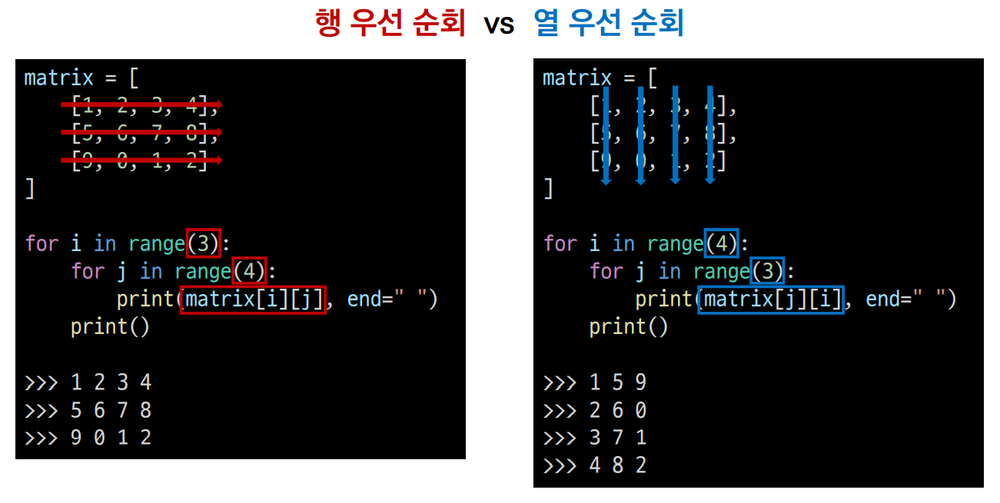
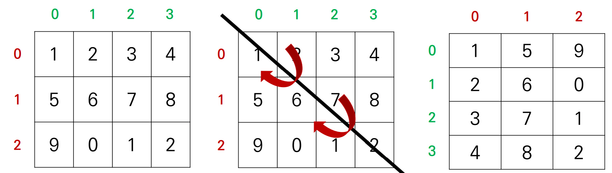
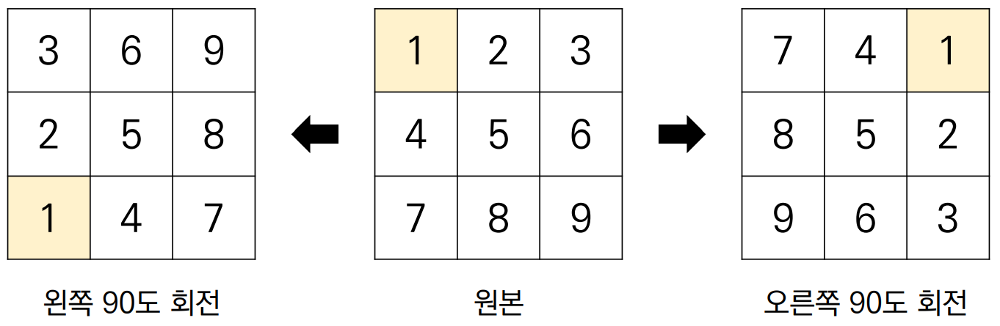

# 이차원리스트 순회
이차원 리스트를 단순 출력하면 다음과 같다.
```python
matrix = [
    [1, 2, 3, 4],
    [5, 6, 7, 8],
    [9, 0, 1, 2]
]
print(matrix)
>>> [[1, 2, 3, 4], [5, 6, 7, 8], [9, 0, 1, 2]]
```&nbsp

이차원 리스트에 담긴 모든 원소를 아래와 같이 출력하고 싶다면??
```python
matrix = [
    [1, 2, 3, 4],
    [5, 6, 7, 8],
    [9, 0, 1, 2]
]
print(matrix)

>>> 1 2 3 4
>>> 5 6 7 8
>>> 9 0 1 2
```&nbsp

인덱스를 이용하여 출력할 수 있다.
하지만 리스트의 요소가 많아진다면 다른 방법을 사용하여야 한다.
```python
matrix = [
    [1, 2, 3, 4],
    [5, 6, 7, 8],
    [9, 0, 1, 2]
]

print(matrix[0][0], matrix[0][1], matrix[0][2], matrix[0][3])
print(matrix[1][0], matrix[1][1], matrix[1][2], matrix[1][3])
print(matrix[2][0], matrix[2][1], matrix[2][2], matrix[2][3])
>>> 1 2 3 4
>>> 5 6 7 8
>>> 9 0 1 2
```

## 이중 for문을 이용한 행 우선 순회
```python
matrix = [
    [1, 2, 3, 4],
    [5, 6, 7, 8],
    [9, 0, 1, 2]
]
for i in range(3):        # 행
    for j in range(4):    # 열
        print(matrix[i][j], end=" ")    # 하나의 행을 출력
    print()
>>> 1 2 3 4
>>> 5 6 7 8
>>> 9 0 1 2
```

| 행 (i)      | 열 (j)      | matrix[i][j] |
|:----------:|:----------:|:------------:|
| 0          | 0          | 1            |
| 0          | 1          | 2            |
| 0          | 2          | 3            |
| 0          | 3          | 4            |
| ========== | ========== | ==========   |
| 1          | 0          | 5            |
| 1          | 1          | 6            |
| 1          | 2          | 7            |
| 1          | 3          | 8            |
|            |            |              |
| 2          | 0          | 9            |
| 2          | 1          | 0            |
| 2          | 2          | 1            |
| 2          | 3          | 2            |

## 이중 for문을 이용한 열 우선 순회
```python
matrix = [
    [1, 2, 3, 4],
    [5, 6, 7, 8],
    [9, 0, 1, 2]
]
for i in range(4):        # 열
    for j in range(3):    # 행
        print(matrix[j][i], end=" ")    # 하나의 열을 출력
    print()
>>> 1 5 9
>>> 1 6 0
>>> 3 7 1
>>> 4 8 2
```

| 열 (i)                                            | 행 (j)                                            | matrix[j][i]                                     |
|:------------------------------------------------:|:------------------------------------------------:|:------------------------------------------------:|
| 0                                                | 0                                                | 1                                                |
| 0                                                | 1                                                | 5                                                |
| 0                                                | 2                                                | 9                                                |
| ================================================ | ================================================ | ================================================ |
| 1                                                | 0                                                | 2                                                |
| 1                                                | 1                                                | 6                                                |
| 1                                                | 2                                                | 0                                                |
| ================================================ | ================================================ | ================================================ |
| 2                                                | 0                                                | 3                                                |
| 2                                                | 1                                                | 7                                                |
| 2                                                | 2                                                | 1                                                |
| ================================================ | ================================================ | ================================================ |
| 3                                                | 0                                                | 4                                                |
| 3                                                | 1                                                | 8                                                |
| 3                                                | 2                                                | 2                                                |

## 행 우선 순회 vs 열 우선 순회
> for문과 matrix 인덱스에 주의하여 작성하면 된다.



## 행 우선 순회를 이용하여 이차원 리스트의 총합 구하기
###  반복문 이용
```python
matrix = [
    [1, 1, 1, 1],
    [1, 1, 1, 1],
    [1, 1, 1, 1]
]

total = 0

for i in range(3):
    for j in range(4):
        total += matrix[i][j]
        
print(total)
>>> 12
```

### Pythonic한 방법
> `map(sum, matrix)`를 통하여 matrix안의 모든 요소`matrix[0], matrix[1], matrix[2]`에 `sum()`함수를 적용한다.
> 그러면 matrix는 `[4, 4, 4]`가 된다.
> 변경된 matrix에 `sum()`함수를 다시 한 번 적용시킨다.
> 결론적으로 모든 요소의 총합을 구할 수 있다.
```python
matrix = [
    [1, 1, 1, 1],
    [1, 1, 1, 1],
    [1, 1, 1, 1]
]

total = sum(map(sum, matrix))
```

## 행 우선 순회를 이용해 이차원 리스트의 최댓값, 최솟값 구하기
### 반복문 이용
- 최댓값
```python
matrix = [
    [0, 5, 3, 1],
    [4, 6, 10, 8],
    [9, -1, 1, 5]
]

max_value = 0

for i in range(3):
    for j in range(4):
        if matrix[i][j] > max_value:
            max_value = matrix[i][j]
            
print(max_value)
>>> 10
```&nbsp;

- 최솟값
```python
matrix = [
    [0, 5, 3, 1],
    [4, 6, 10, 8],
    [9, -1, 1, 5]
]

max_value = 99999999

for i in range(3):
    for j in range(4):
        if matrix[i][j] < min_value:
            min_value = matrix[i][j]
            
print(min_value)
>>> 10
```
### Pythonic한 방법
```python
matrix = [
    [0, 5, 3, 1],
    [4, 6, 10, 8],
    [9, -1, 1, 5]
]

max_value = max(map(max, matrix))
min_value = min(map(min, matrix))

print(max_value)
>>> 10

print(min_value)
>>> -1
```

# 전치
> 행렬의 행과 열을 서로 맞바꾸는 것


```python
matrix = [
    [1, 2, 3, 4],
    [5, 6, 7, 8],
    [9, 0, 1, 2]
]

transpoosed_matrix = [[0] * 3 for _ in range(4)]    # 전치 행렬을 담을 이차원 리스트를 초기화함 (행과 열의 크기가 반대)
'''
transposed_matrix = [
    [0, 0, 0],
    [0, 0, 0],
    [0, 0, 0],
    [0, 0, 0]
]
'''
for i in range(4):
    for j in range(3):
        transposed_matrix[i][j] = matrix[j][i]    # 행, 열 맞바꾸기
'''
transposed_matrix = [
    [1, 5, 9],
    [2, 5, 0],
    [3, 7, 1],
    [4, 8, 2]
]
'''
```

# 회전
> 이차원 리스트를 왼쪽, 오른쪽으로 회전하는 경우


## 왼쪽으로 90도 회전하기
```python
matrix = [
    [1, 2, 3],
    [4, 5, 6],
    [7, 8, 9]
]

n = 3
rotated_matrix = [[0] * n for _ in range(n)]

for i in range(n):
    for j in range(n):
        rotated_matrix[i][j] = matrix[j][n-i-1]
```
## 오른쪽으로 90도 회전하기
```python
matrix = [
    [1, 2, 3],
    [4, 5, 6],
    [7, 8, 9]
]

n = 3
rotated_matrix = [[0] * n for _ in range(n)]

for i in range(n):
    for j in range(n):
        rotated_matrix[i][j] = matrix[n-j-1][i]
```