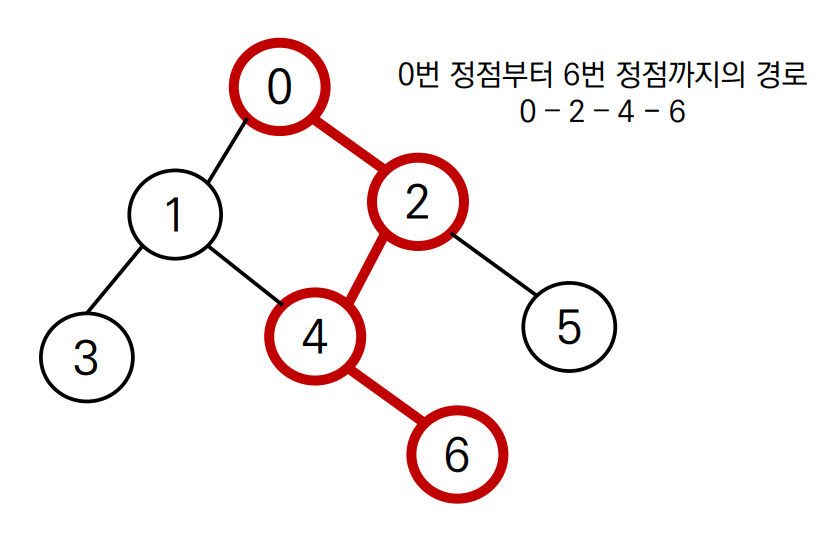
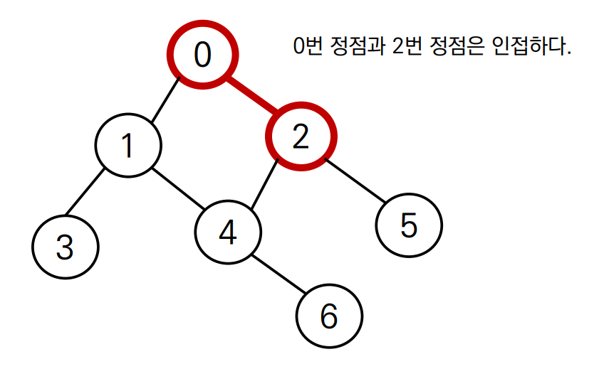
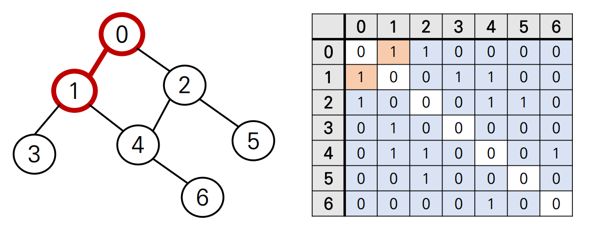

# 그래프란?
> 정점(Vertex)와 이를 연결하는 간선(Edge)들의 집합으로 이루어진 비선형 자료구조

## 그래프 관련 용어 정리
- **정점(Vertex)**: 간선으로 연결되는 객체, 노드(Node)라고도 한다.


- **간선(Edge)**: 정점 간의 관계(연결)을 표현하는 선

  


- **경로(Path)**: 시작 정점부터 도착 정점까지 거치는 정점을 나열한 것

  


- **인접(Adjacency)**: 두 개의 정점이 하나의 간선으로 직접 연결된 상태를 의미

    

    


# 그래프의 종류
## 무방향 그래프 (Undirected graph)
> 간선의 방향이 없는 가장 일반적인 그래프
> 간선을 통해 양방향의 정점 이동 가능

- 차수(Degree): 하나의 정점에 연결된 간선의 개수
- 모든 정점의 차수의 합 = 간선 수 x 2


## 유방향 그래프 (Directed graph)
> 간선의 방향이 있는 그래프
> 간선의 방향이 가리키는 정점으로 이동 가능

- 차수(Degree): 진입 차수와 진출 차수로 나누어짐
    - 진입 차수(In-degree): 외부 정점에서 한 정점으로 들어오는 간선의 수
    - 진출 차수(Out-degree): 한 정점에서 외부 정점으로 나가는 간선의 수


# 그래프의 표현
> 알고리즘 문제에서는 그래프를 **간선이 연결하는 두 정점(인접한 정점)의 목록**으로 제공한다.
> 인접한 두 정점 == 서로 직접 연결된 정점이다.
> 따라서 인접한 정점들의 목록의 입력을 통해 그래프를 *인접 행렬* 또는 *인접 리스트* 방식으로 표현할 수 있다.


## 인접 행렬 (adjacent matrix)
> 두 정점을 연결하는 간선이 없으면 0, 있으면 1을 가지는 행렬



> 입력

```
0 1
0 2
1 3
1 4
2 4
2 5
4 6
```


> 인접 행렬 만들기

```python
n = 7
m = 7

graph = [[0] * n for _ in range(n)]

for _ in rangfe(m):
    v1, v2 = map(int, input().split())
    graph[v1][v2] = 1
    graph[v2][v1] = 1
```


> 인접 행렬 결과

```
graph = [
[0, 1, 1, 0, 0, 0, 0],
[1, 0, 0, 1, 1, 0, 0],
[1, 0, 0, 0, 1, 1, 0],
[0, 1, 0, 0, 0, 0, 0],
[0, 1, 1, 0, 0, 0, 1],
[0, 0, 1, 0, 0, 0, 0],
[0, 0, 0, 0, 1, 0, 0]
]
```


## 인접 리스트 (Adjancent list)

> 리스트를 통해 각 정점에 대한 인접 정점들을 순차적으로 표현하는 방식


> 입력

```
0 1
0 2
1 3
1 4
2 4
2 5
4 6
```


> 인접 리스트 만들기

```python
n = 7
m = 7

graph = [[] for _ in range(n)]

for _ in range(m):
    v1, v2 = map(int, input().split())
    graph[v1].append(v2)
    graph[v2].append(v1)
```


> 인접 리스트 결과

인덱스 번호가 정점의 번호를 의미함!

```
graph = [
[1, 2],
[0, 3, 4],
[0, 4, 5],
[1],
[1, 2, 6],
[2],
[4]
]
```


## 인접 행렬 vs 인접 리스트

- 인접 행렬
  - 직관적이고 만들기 편함
  - 불필요하게 공간이 낭비됨
- 인접 리스트
  - 연결된 정점만 저장하여 효율적임