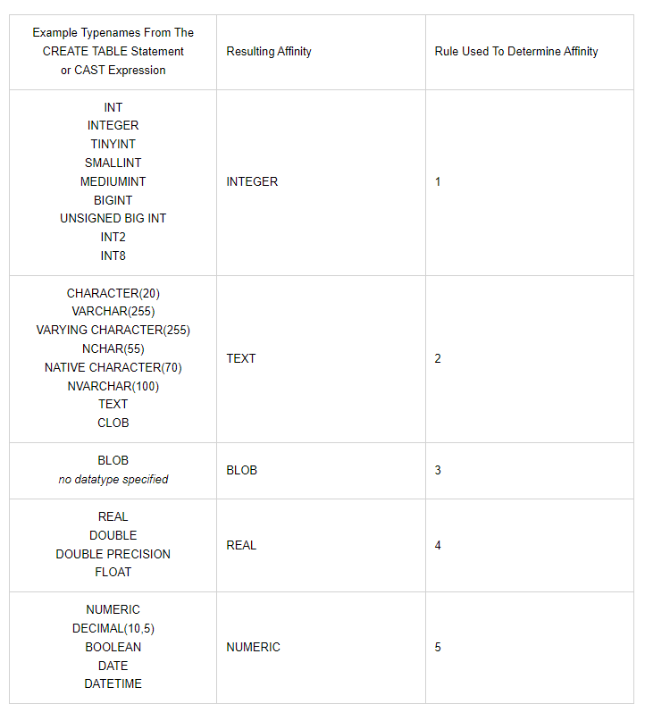

# Database

> 체계화된 데이터의 모임
>
> 몇 개의 자료 파일을 **조직적으로 통합**하여 자료 항목의 중복을 없애고 자료를 **구조화**하여 기억시켜 놓은 자료의 집합체


## 데이터베이스로 얻는 장점

- 데이터 중복 최소화
- 데이터 무결성 (정확한 정보 보장)
- 데이터 일관성
- 데이터 독립성 (물리적/ 논리적)
- 데이터 표준화
- 데이터 보안 유지


# RDB (Relational Database)

> 서로 관련된 데이터를 저장하고 접근할 수 있는 데이터 베이스 유형
>
> 키와 값들의 간단한 관계를 표 형태로 정리한 데이터베이스


## 스키마 (schema)

> 데이터베이스에서 자료의 구조, 표현방법, 관계 등 전반적인 명세를 기술한 것

| column  | datatype |
| :-----: | :------: |
|   id    |   INT    |
|  name   |   TEXT   |
| address |   TEXT   |
|   age   |   INT    |


## 테이블 (table)

> 열(컬럼/필드)과 행(레코드/값)의 모델을 사용해 조직된 데이터 요소들의 집합
>
> 스키마를 기반으로 작성됨

- **열, 컬럼, 필드**: 각 열에 고유한 데이터 형식 지정
- **행, 로우, 레코드**: 실제 데이터가 저장되는 형태
- **기본키 (Primary Key, PK)**: 각 레코드의 고유 값
  - 반드시 설정해야 하며, 데이터베이스 관리 및 관계 정립시 주요하게 활용됨

|  id  |  name  | address | age  |
| :--: | :----: | :-----: | :--: |
|  1   | 홍길동 |  제주   |  20  |
|  2   | 김길동 |  서울   |  30  |
|  3   | 박길동 |  독도   |  40  |


# RDBMS (관계형 데이터베이스 관리 시스템)

> 관계형 모델을 기반으로 하는 데이터베이스 관리 시스템
>
> MySQL, SQLite, ORACLE, PostgreSQL, SQLServer 등이 있음


# SQLite

> 서버 형태가 아닌 파일 형식으로 응용 프로그램에 넣어서 사용하는 비교적 가벼운 데이터베이스
>
> 로컬에서 간단한 DB 구성을 할 수 있음


## SQLite Data Type

- NULL
- INTEGER
  - 크기에 따라 0, 1, 2, 3 또는 8바이트에 저장된 부호가 있는 정수
- REAL
  - 8바이트 부동 소수점 숫자로 저장된 부동 소수점 값
- TEXT
- BLOB
  - 입력된 그대로 정확히 저장된 데이터 (별다른 타입 없이 그대로 저장)

## SQLite Type Affinity

> 특정 컬럼에 저장하도록 권장하는 데이터 타입
>
> 다른 타입의 데이터 삽입시 컬럼에 맞게 알아서 들어감 (다른 DB에서 사용하는 데이터 타입을 사용해도 무방)

- INTEGER
- TEXT
- BLOB
- REAL
- NUMERIC



# SQL (Structured Query Language)

> RDBMS의 데이터 관리를 위해 설계된 특수 목적 프로그래밍 언어
>
> 데이터베이스 스키마 생성 및 수정
>
> 자료의 검색 및 관리
>
> 데이터베이스 객체 접근 조정 관리


- DDL (Data Definition Language)
  - 관계형 데이터베이스 구조(테이블, 스키마)를 정의하기 위한 명령어
  - ex) CREATE, DROP, ALTER
- DML (Data Maniulation Language)
  - 데이터를 저장, 조회, 수정, 삭제 (CRUD) 등을 위한 명령어
  - ex) INSERT, SELECT, UPDATE, DELETE
- DCL (Data Control Language)
  - 데이터베이스 사용자의 권한 제어를 위해 사용하는 명령어
  - ex) GRANT, REVOKE, COMMIT, ROLLBACK


# 테이블 생성 및 삭제

## 데이터베이스 생성하기

```sqlite
sqlite3 tutorial.sqlite3
sqlite> .database
```

이때 `.database`처럼 `.`으로 시작하는 명령어는 sqlite에서만 활용되는 명령어임


## csv 파일을 table로 만들기

```sqlite
.mode csv
.import hellodb.csv examples

-- 테이블 만들어졌는지 확인
.tables
examples
```

