# ✔CSS layout techniques

- Display
- Position
- Float
- Flexbox
- Grid
- 기타 (Responsive Web Design, Media Queries)


# ✔CSS Position

> 문서 상에서 요소의 위치를 지정함

- `static`: 일반적인 요소의 배치 순서를 따름 (좌측 상단부터~)
  - 모든 태그의 기본 값
  - 부모 요소 내에서 배치될 때는 부모 요소의 위치를 기준으로 배치됨
- `relative`: 상대 위치
  - 자기 자신의 static 위치를 기준으로 이동함 **(normal flow) 유지**
  - 레이아웃에서 요소가 차지하는 공간은 static일 때와 같음(normal position 대비 offset)
- `absolute`: 절대 위치
  - 요소를 일반적인 문서 흐름에서 제거 후 레이아웃에 공간을 차지하지 않음 **(normal flow에서 벗어남)**
  - **static이 아닌 가장 가까이 있는 부모/조상 요소를 기준으로 이동** (없는 경우 브라우저 화면 기준으로 이동)
- `fixed`: 고정 위치
  - 요소를 일반적인 문서 흐름에서 제거 후 레이아웃에 공간을 차지하지 않음 (normal flow에서 벗어남)
  - 부모 요소와 관계없이 **viewport(화면)을 기준**으로 이동 => **스크롤 시에도 항상 같은 곳에 위치함**
- `sticky`: 스크롤에 따라 static -> fixed으로 변경
  - 평소에는 문서 안에서 `position: static` 상태와 같이 일반적인 흐름에 따름
  - 스크롤 위치가 임계점에 이르면 `position: fixed`와 같이 화면에 고정할 수 있음


## static

```css
.box {
    width:100px;
    height:100px;
    background-color:pink
}
```

```html
<body>
    <div class="box"> </div>
</body>
```

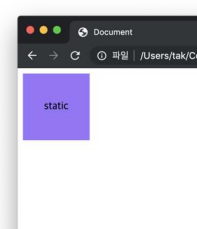

## relative

> 기존 위치(normal position) 대비 offset

```css
.relative {
    position: relative;
    top: 100px;
    left: 100px;
}
```

```html
<body>
    <div class="box relative"> </div>
</body>
```

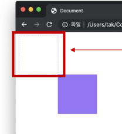


## absolute

> normal flow에서 벗어나 **부모/조상 요소를 기준**으로 위치

```css
.parent {
    position: relative;
}
.absolute-child {
    position: absolute;
    top: 50px;
    left: 50px;
}
```

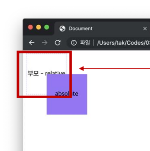


## fixed

> normal flow에서 벗어나 Viewport 기준으로 위치
>
> 보통 페이지 최상단으로 이동하는 버튼으로 사용됨

```css
.fixed {
    position: fixed;
    bottom: 0;
    right: 0;
}
```

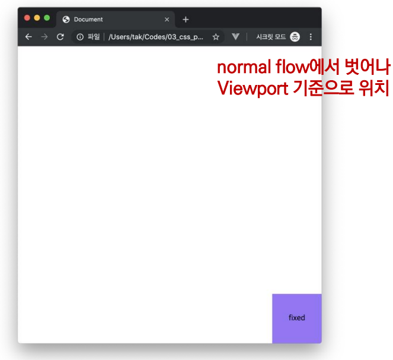


## sticky

> 스크롤에 따라 static -> fixed로 변경됨
>
> sticky 속성을 가진 박스는 평소에는 static 상태와 같지만 스크롤 위치가 임계점에 이르면 박스를 화면에 고정하는 속성
>
> 일반적으로 Navigation Bar에서 사용됨


## 📌absolute vs relative

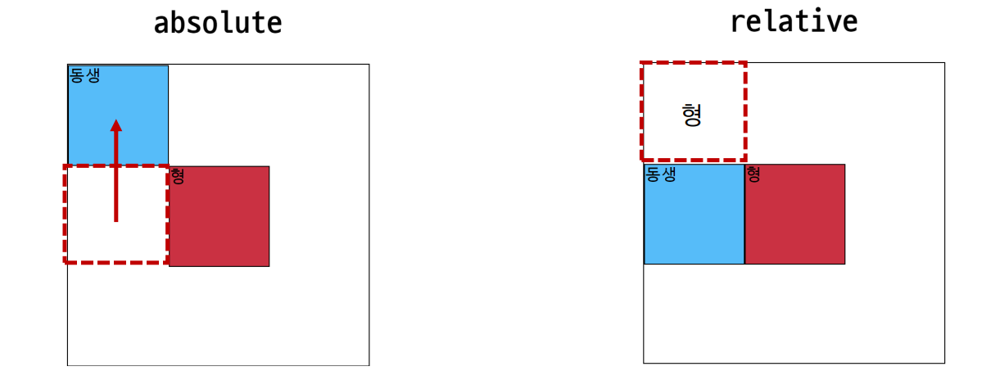

- `absolute`는 normal flow에서 벗어나서 다음 블록 요소가 좌측 상단으로 붙음

- `relative`는 normal flow를 유지함, 실제 위치는 그대로고 사람 눈에만 이동함


# ✔Float

> 박스를 왼쪽 혹은 오른쪽으로 이동시켜 텍스트를 포함한 인라인 요소들이 주변을 wrapping 하도록 함
>
> 요소가 Normal flow를 벗어나도록 함


```css
.box {
    width: 150px;
    height: 150px;
    border: 1px solid black;
    background-color: crimson;
    color: white;
    margin-right: 30px;
}

.left {
    float: left;
}
```

```html
<body>
    <div class="box left">float left</div>
    <p>lorem300</p>
</body>
```


`box`에 `float: left`를 적용해서 왼쪽에 배치함

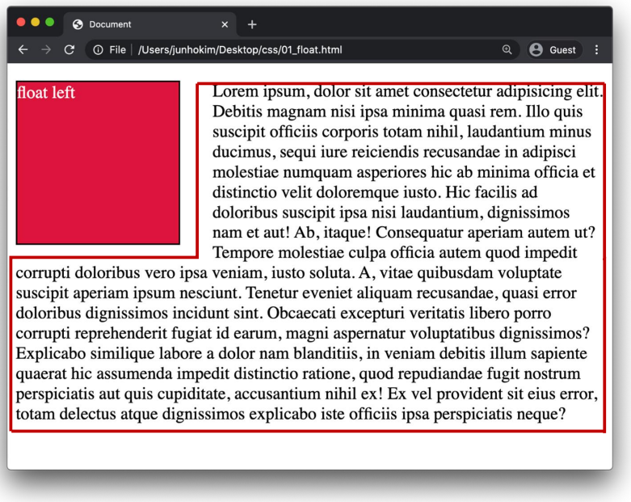


# ✔Flexbox

> 행과 열 형태로 아이템을 배치하는 1차원 레이아웃 모델
>
> Normal Flow를 벗어나는 수단인 `Position`과 `Float`는 수직 정렬, 아이템의 간격을 동일하게 배치하는 것이 어려웠으나
>
> Flexbox으로 간단하게 아이템을 배치할 수 있음

- **축**

  - main axis (메인 축)

  - cross axis (교차 축)
    - `flex-direction: row`, `flex-direction: column`

- **구성 요소**

  - Flex Container (부모 요소)

    - flexbox 레이아웃을 형성하는 가장 기본적인 모델

    - Flex Item들이 놓여있는 영역

    - display 속성을 `flex` 혹은 `inline-flex`으로 지정함

    - ```css
      .flex-container {
          display: flex;
      }
      ```

  - Flex Item (자식 요소)
    - 컨테이너에 속해 있는 컨텐츠(박스)

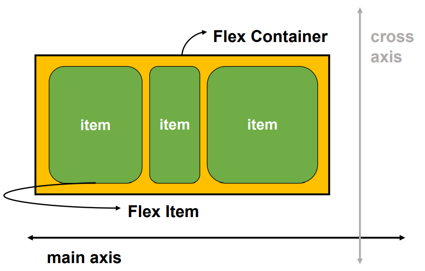


## Flex 속성

- **배치 설정**
  - flex-direction
  - flex-wrap
- **공간 나누기**
  - justify-content (main axis)
  - align-content (cross axis)
- **정렬**
  - align-items (모든 아이템을 cross axis 기준으로 정렬)
  - align-self (개별 아이템 정렬)


### Flex 속성 1: flex-direction

> Main axis의 방향을 설정함
>
> 역방향은 웬만하면 잘 안 씀

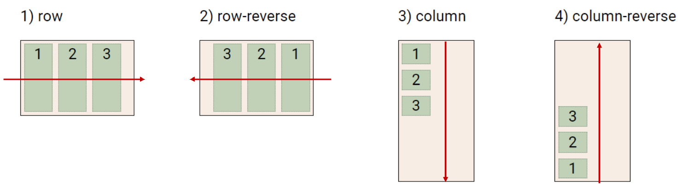

### Flex 속성 2: flex-wrap

> 아이템이 컨테이너를 벗어나는 경우 해당 영역 내에 배치되도록 설정함
>
> 기본적으로 컨테이너 영역을 벗어나지 않도록 함

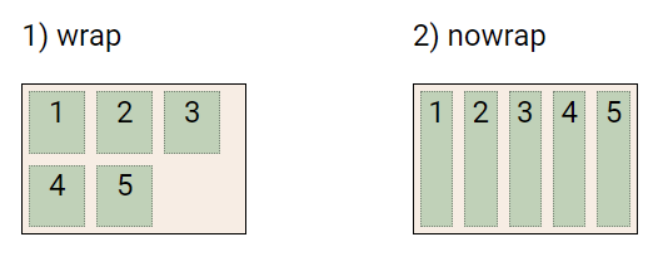

`wrap`으로 설정 시, 아이템이 넘친다면 그 다음 줄에 배치함


### Flex 속성 3: flex-flow (flex-direction & flex-wrap)

> flex-direction과 flex-wrap의 shorthand (간결한 표현)
>
> flex-direction과 flex-wrap에 대한 설정 값을 차례로 작성하면 된다.
>
> ex) flex-flow: row nowrap;


### Flex 속성 4: justify-content

> Main axis을 기준으로 공간을 배분함

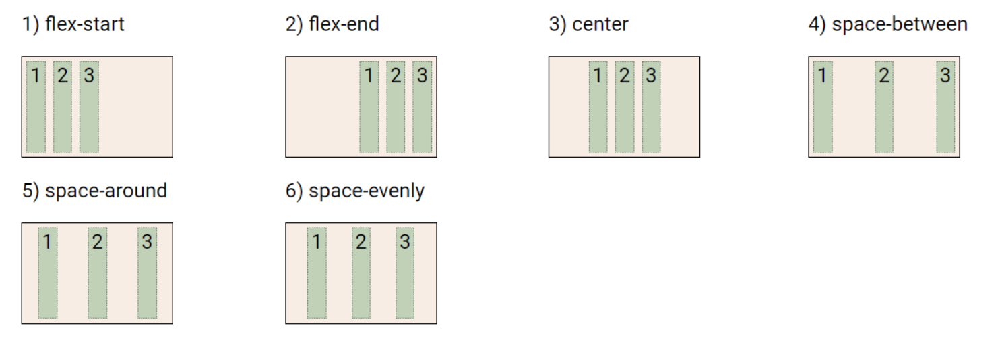


### Flex 속성 5: align-content

> Cross axis를 기준으로 공간을 배분함
>
> 아이템이 한 줄로 배치되는 경우는 확인할 수 없음 (한 줄일 때 적용하면)

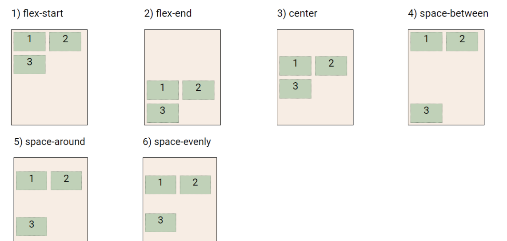


### justify-content & align-content

- `flex-start`: 기본값임, 아이템들을 axis 시작점으로 옮김(배분함)
- `flex-end`: 아이템들을 axis 끝 쪽으로 옮김
- `center`: 아이템들을 axis 중앙으로 옮김
- `space-between`: 아이템 사이의 간격을 균일하게 분배함
- `space-around`: 아이템을 둘러싼 영역을 균일하게 분배함 (양쪽 모두 동일한 마진이 있음)
- `space-evenly`: 전체 영역에서 아이템 간 간격을 균일하게 분배함 (모든 마진 너비가 같아짐)


### Flex 속성 6: align-items

> 모든 아이템을 Cross axis 기준으로 정렬

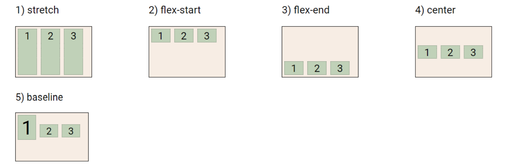


### Flex 속성 7: align-self

> 개별 아이템을 Cross axis 기준으로 정렬
>
> **이 속성은 컨테이너에 적용하는 것이 아니라 개별 아이템에 적용하는 것임!!**

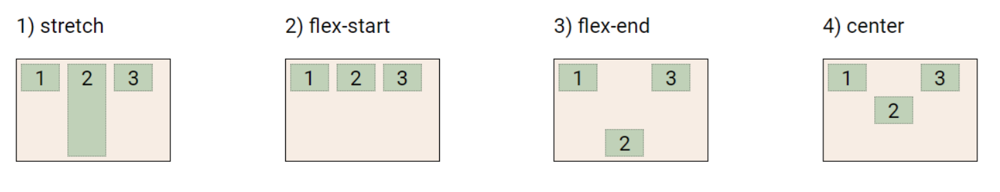

### align-items & align-self

`Cross axis`을 중심으로

- `stretch`: 기본 값, 컨테이너를 가득 채움
- `flex-start`: 위
- `flex-end`: 아래
- `center`: 가운데
- `baseline`: 텍스트 baseline에 기준선을 맞춤


## 추가

> wrap을 적용하고 한 줄짜리에 content하면 적용되지만 nowrap에서는 한 줄짜리에 content가 적용안됨

```html
<!DOCTYPE html>
<html>
  <head>
    <style>
      .card_list{
        display:flex;
        /* flex-flow:row wrap; */
        height:3000px;
        width:1300px;
        background-color: linen;
        justify-content: space-evenly;
        /* align-content: flex-end; */
        align-items: flex-end;
        /* wrap을 적용하고 한 줄짜리에 content하면 적용되지만 nowrap에서는 한 줄짜리에 content가 적용안됨 */
      }
      div > div {
        width:300px;
        height:500px;
        background-color:pink;
      }
    </style>
  </head>
  <body>
    <div class="card_list">
      <div></div>
      <div></div>
      <div></div>
    </div>
  </body>
</html>
```


## Flex에 적용하는 속성

- `flex-grow`: 남은 영역을 아이템에 분배함
- `order`: 배치 순서

```html
<div class="flex_item grow-1 order-3">1</div>
<div class="flex-item grow-1">2</div>
<div class="flex-item order-1">3</div>
<div class="flex-item order-2">4</div>
```

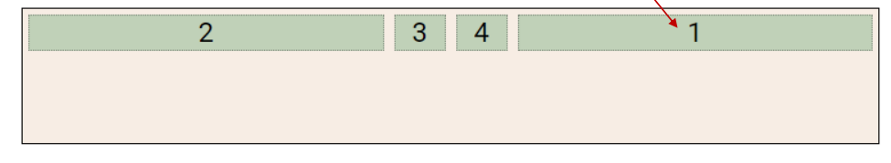

