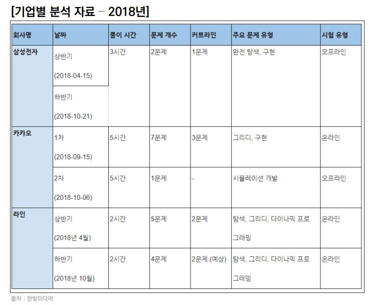
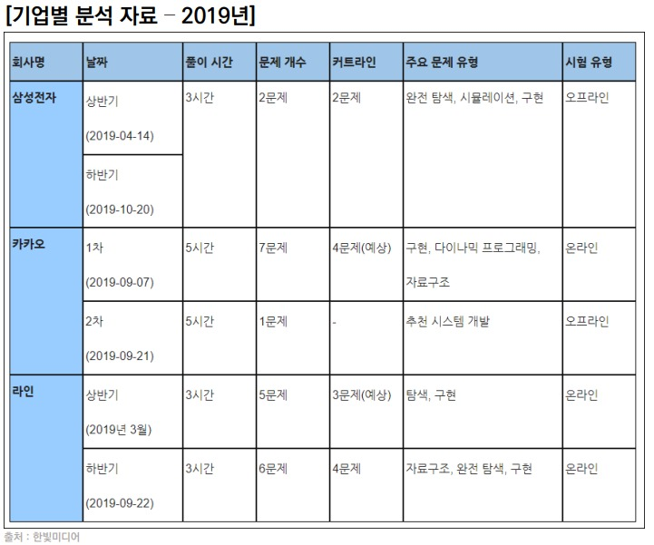

# 알고리즘이란?
> 어떤 문제를 해결하기 위해 정해진 일련의 절차나 행동
> 이때 문제란, Input을 넣었을 때, 원하는 Output이 나오도록 하는 것

# 코딩테스트란?
> 기업에서 지원자를 대상으로 코딩을 통한 **알고리즘 기반** 문제 해결 능력을 테스트 하는 것
- 문제 해결력: 문제 **의도**를 정확히 파악하고, 적절한 **해결** 방법을 적용할 수 있는가?
- 해결 방법을 **프로그래밍**을 통해 능숙하게 **구현**할 수 있는가?

# 코딩테스트의 종류
## 온라인 코딩테스트
### 온라인 코딩테스트 사전 안내 메일
- 문제 풀이 사이트
- 문제 수
- 제한 시간
- 시작 및 종료 시간
- 문의 안내

### 온라인 코딩테스트 Tip
- 사전에 연습장과 필기도구 준비
- 테스트 케이스 이외의 **엣지 케이스**도 확인!!
- 인터넷, IDE, 알고리즘 노트 적극 활용
    - [깃허브 온라인 코딩테스트 준비 알고리즘 노트]([GitHub - ndb796/Python-Competitive-Programming-Team-Notes: Python Library for Programming Competition](https://github.com/ndb796/Python-Competitive-Programming-Team-Notes))

## 오프라인 코딩테스트
### 개발형 코딩테스트
> 통제된 공간에서 코딩테스트 진행
> 보통 언어 및 개발 환경에 제약이 없으므로 가장 풀기 유리한 언어를 사용하자 -> 파이썬

### 화이트보드 손코딩
> 지원자가 어떤 방식으로 문제를 해결하는지 **논리, 과정, 커뮤니케이션** 스킬을 평가함
> 문제가 길고 어렵진 않지만 문제를 어떻게 해결할 것인지에 대한 나의 생각을 설명할 수 있어야 함

### 기업별
> 기업별로 주요 문제 유형과 시험 유형 등을 정리하여 놓으면 코딩테스트에 준비하기 수월함



# 코딩테스트 준비하기
> 진짜 답은 **많이 풀기**
## 대표 문제 풀이 사이트
| 문제 풀이 사이트 및 링크                                   | 특징                                       |
|:------------------------------------------------:|:----------------------------------------:|
| [백준 온라인 저지(BOJ)](https://www.acmicpc.net/)       | 가장 많이 사용하는 플랫폼, 최다 문제 보유, 유형별/ 단계별 문제 제공 |
| [프로그래머스(Programmers)](https://programmers.co.kr) | 실제 코딩테스트 환경과 유사, 카카오 기출문제 제공             |
| [코드업(CodeUp)](https://codeup.kr/)                | 기초 100제                                  |
|                                                  |                                          |
## 코딩테스트 Tip
1. 연습 때는 같은 유형 문제를 단기간에 여러 번 반복하는 것이 좋고, 코딩테스트 직전에는 모의고사처럼 시간 제한을 두고 여러 유형을 푸는 것이 좋다.
2. 오랜 시간 고민을 했음에도 풀리지 않는 경우 답을 보고 난 후 반드시 답을 보지 않고도 한번 더 풀어서 내 것으로 만들어야 한다. 최대한 타인의 답을 많이 보면서 여러 풀이를 습득하는 것이 좋다.
3. 알고리즘 문제는 약 300~350 문제 정도 풀면 합격할 수 있다! (풀었다의 기준: 다시 풀어도 맞출 수 있을 정도)
4. 변수명 대충 짓지 않기
5. 언어가 가지는 내장 함수, 라이브러리를 적극 활용 하기
6. 반복되는 코드는 함수화를 통해 가독성 있게 작성하기
7. 면접을 위해 풀이를 남에게 설명하는 연습이 반드시 필요함

# 데이터 구조 & 알고리즘
> 프로그램 = 데이터 구조 + 알고리즘
> 데이터를 다양한 방식으로 저장하고 조회, 삽입, 변경, 삭제와 같은 조작 기능을 제공한다.

## 데이터 구조를 배우는 이유
> 데이터를 필요에 따라 저장하고 활용할 수 있으므로 **문제를 더 효율적으로 풀기 위한 도구**가 된다.
> 도구(데이터 구조)의 특성을 알아야 제대로 활용을 할 수 있다.

## 코딩테스트 정복을 위한 데이터 구조와 알고리즘
- 데이터 구조
    - Array (배열)
    - Linked List (연결리스트)
    - Hash (해쉬)
    - Stack (스택)
    - Queue (큐)
    - Prioiry Queue (우선순위 큐)
    - Heap (힙)
    - Tree (트리)
    - Graph (그래프)
- 알고리즘
    - 기본
        - 완전탐색, 재귀, 시뮬레이션, 그리디
    - 심화
        - DFS, BFS
        - 백트래킹
        - 이진탐색
        - DP
        - 다익스트라
        - 크루스칼
        - 프림

# 간단한 입력 & 출력
## 입력 활용 예시 (input)
> input()은 사용자의 **입력 한 줄**을 **문자열**로 받는 함수다.
```python
word = input()
>>> Sunyoung
```
- input()과 map()함수를 이용해 원하는 대로 입력 받기
```python
# 문자열 입력 받기
a = input()

# 한 개 숫자 입력 받기
b = int(input())
c = float(input())

# 여러 개 숫자 입력 받기
d, e = map(int, input().split())
f, g, h = map(float, input().split())
```
### 파이썬의 내장함수 map(function, iterable)
```python
map(int, ["1", "2", "3"])
# 각 원소에 int를 적용하여 정수 1, 2, 3을 반환함

map(float, [1, 2, 3])
# 각 원소에 float를 적용하여 부동소수점 1.0, 2.0, 3.0을 반환함

map(int, '123')
# 리스트 뿐만 아니라 문자열에도 적용 가능
# '123'은 문자열인데, 문자열의 각 원소에 int를 적용하여 정수 1, 2, 3을 반환함
```
### map으로 입력 받는 과정
```python
# 1
a, b = map(int, input().split())
>>> 1 2

# 2
a, b = map(int, "1 2".split())

# 3
a, b = map(int, ["1", "2"])

# 4
a, b = 1, 2
```

## 출력 활용 예시 (print)
> print()는 데이터를 **출력**할 수 있는 함수이며, 자동적으로 **줄 바꿈** 발생
```python
print("Sun")
print("young")
>>> Sun
>>> young
```
- **콤마**를 이용해 여러 인자를 넣으면 **공백**을 기준으로 출력
```python
a = 'Sun'
b = 'Young'
print(a, b)
>>> Sun Young
```
- **end**, **sep** 옵션을 사용하여 출력 조작하기
```python
a = 'Sun'
b = 'Young'

print(a, end='@')
print(b)
>>>Sun@Young

print(a, b, sep='\n')
>>> Sun
>>> Young
```