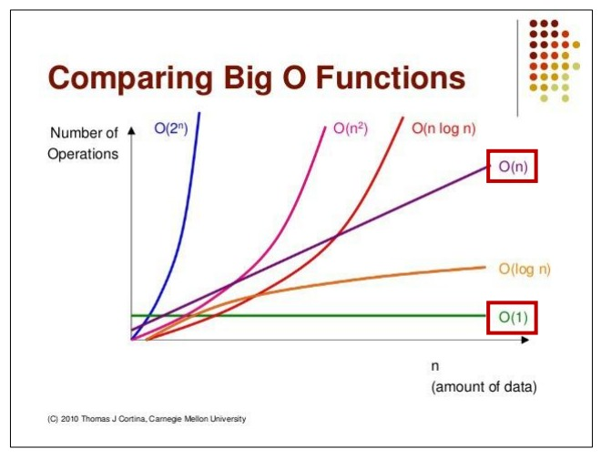

# 알고리즘의 시간 복잡도
> 좋은 알고리즘이란 Input을 넣은 후 Output이 나오는 **시간**이 짧은 알고리즘
좋은 알고리즘을 찾기 위해서는 개개인의 컴퓨팅 환경에 영향을 받지 않는 객관적인 측정 시간이 필요함
=> 객관적인 알고리즘 소요 시간을 측정하기 위해 알고리즘 내부에서 **기본 연산이 몇 번** 일어나는지 살펴봄, 따라서 `기본 연산의 총 횟수 == 알고리즘의 소요 시간`

- 다음과 같은 상황에서는 몇 번의 기본 연산이 일어날까? (== 알고리즘의 소요시간이 몇일까?)
```python
def count(word, char):
    total = 0
    for i in word:
        if i == char:
            total += 1
    return total
```
```python
count("apple", "p")
>>> 2
```
=> 입력의 개수에 따라 소요시간이 달라짐
=> 따라서 **최악의 입력 n개**가 들어온다고 가정하여 계산함
=> 입력 n개에 따른 소요시간을 수식으로 세울 수 있고 이것이 시간복잡도를 평가하는 하나의 지표

# 시간 복잡도
> 문제를 해결하는데 걸리는 시간과 입력의 함수 관계를 나타냄
> 단순하게 **알고리즘의 수행 시간**을 의미한다고 생각하기
- 시간 복잡도가 높다 -> 느린 알고리즘
- 시간 복잡도가 낮다 -> 빠른 알고리즘

# 빅오(Big-O) 표기법
> 입력 n이 **무한대**로 커진다고 가정하고 시간 복잡도를 간단하게 표시하는 것
> **최고차항만 남기고** 계수와 상수는 제거함
> 이유: n이 무한대로 커질 시에는 계수와 상수는 큰 영향을 미치지 않기 때문

- 예시
```
A: 6n + 4
B: 3n + 2
C: 3n^2 + 6n + 1
```
알고리즘의 수행 시간이 위와 같다면 빅오 표기법은
```
A: O(n)
B: O(n)
C: O(n^2)
```
이때, A와 B의 소요시간은 2배의 차이가 났지만 점근적 표기법에 의해 동일한 시간 복잡도를 나타냄

## 소요시간 순 빅오 표기법


| 빅오 표기법   | 쓰이는 상황                    | 예시2                              |
|:--------:|:-------------------------:|:--------------------------------:|
| O(1)     | 단순 산술 계산(덧셈, 뺄셈, 곱셈, 나눗셈) | a + b, 100 * 200                 |
| O(logN)  | 크기 N인 리스트를 반절씩 순회/ 탐색     | 이진탐색, 분할정복                       |
| O(N)     | 크기 N인 리스트를 순회             | 리스트 순회, 1중 for 문                 |
| O(NlogN) | 크기 N인 리스트를 반절씩 탐색 * 순회    | 높은 성능의 정렬(Merge/Quick/Heap Sort) |
| O(N^2)   | 크기 M, N인 2중 리스트를 순회       | 2중 리스트 순회, 2중 for 문              |
| O(N^3)   | 3중 리스트를 순회                | 3중 리스트 순회, 3중 for 문              |
| O(2^N)   | 크기 N 집합의 부분 집합            | 크기가 N인 집합의 부분 집합                 |
| O(N!)    | 크기 N 리스트의 순열              | 크기가 N인 순열                        |
## 실제 문제에 어떻게 적용할까?
> 실제 알고리즘 문제는 **초** 단위로 제한 시간이 주어짐
> 보통 **1초에 1억 번** 연산으로 계산 함
> 입력의 개수에 따라 반복문을 몇 중으로 순회할 수 있는지 파악해야 함

### 일반적인 상황에서 1초가 걸리는 입력의 크기
- O(N): 1억
- O(NlogN): 500만
- O(N^2): 1만
- O(N^3): 500
- O(2^N): 20
- O(N!): 10

### 실전 예시
> 문제: 연속된 숫자들의 합 구하기
> 입력: 자연수 N이 입력된다. (1 ≤ N ≤ 1,000,000,000)
> 출력: 1부터 N까지의 연속된 수를 모두 더한 값을 반환한다.
> 제한 시간: 1초

1. 첫 번째 방법 - 1부터 n까지 일일히 더하기
``` python
def get_total(n):
    total = 0
    for i in range(1, n+1):
        total += i
    return total

print(get_total(10))
>>> 55
print(get_total(1000000000))
>>> 제한 시간 1초 초과
```
2. 두 번째 방법 - 가우스의 합 공식
```python
def get_total(n):
    return (n * (n + 1)) // 2

print(get\_total(10))
>>> 55
print(get_total(1000000000))
>>> 500000000500000000
```
> 같은 Output을 만드는 알고리즘이라도 시간 복잡도에 따라 성능이 달라질 수 있고 시험에서 정답 여부가 갈리는 포인트가 될 수 있다!

### 내장 함수, 메소드의 시간 복잡도도 확인할 필요가 있다.
> for 문을 1번만 썼다고 해서 무조건 O(n)인 것은 아니다.
> for문을 1번만 쓰더라도 for문 안에 O(n)의 내장 함수를 사용했다면 사실상 이중 for문과 다를 것이 없기 때문이다.
> 따라서 내장 함수와 메소드를 사용할 때도 시간 복잡도에 유의하며 사용하여야 한다.