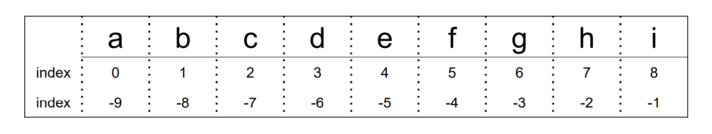
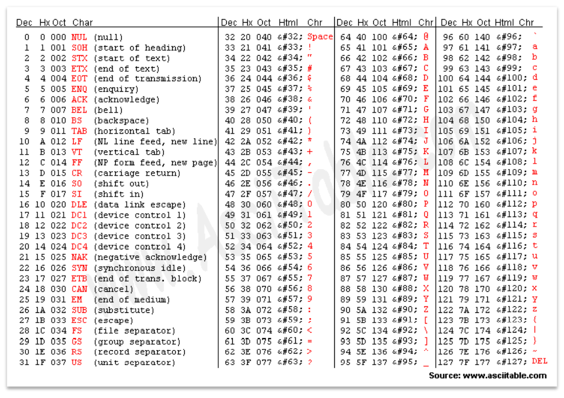

# 문자열 슬라이싱
```python
s = 'abcdefghi'
```

```python
s[2:5]
# 'cde'
s[-6:-2]
# 'defg'
s[2:-4]
# 'cde'
s[2:5:2]
# 'ce'
s[-6:-1:3]
# 'dg'
s[2:5:-1]    # 2에서 5까지 -1씩 갈 수 없으므로 빈 문자열 출력
# ''
s[5:2:-1]
# 'fed'

s[:3]
# 'abc'
s[5:]
# 'fghi'
s[:]
# 'abcdefghi'
s[::-1]
# 'ihgfedcba'
s[10:20]
# ''
```
## 문자열 슬라이싱 연습 예제
- BOJ 10988 [팰린드롬인지 확인하기]([10988번: 팰린드롬인지 확인하기 (acmicpc.net)](https://www.acmicpc.net/problem/10988)
```python
pel = input()
print(1 if pel == pel[::-1] else 0)
```
# 문자열 메소드
## .split(기준 문자)
> 문자열을 일정 **기준**으로 나누어 **리스트로 반환**
> 괄호 안에 아무것도 넣지 않으면 자동으로 공백을 기준으로 설정
```python
word = 'I play the piano'
print(word.split())
# ['I', 'play', 'the', 'piano']

word = 'apple, banana, orange, grape'
print(word.split(', '))
# ['apple', 'banana', 'orange', 'grape']

word = 'This_is_snake_case'
print(word.split('_'))
# ['This', 'is', 'snake', 'case']
```

## .strip(제거할 문자)
> 문자열의 **양쪽** 끝에 있는 특정 문자를 모두 **제거**한 새로운 문자열 반환
> 괄호 안에 아무것도 넣지 않으면 자동으로 공백을 제거 문자로 설정
> 제거할 문자를 여러 개 넣으면 해당하는 모든 문자들을 제거
```python
word = '   Hello World   '
print(word.strip())
# Hello world

word = 'aHello Worlda'
print(word.strip('a'))
# Hello World

word = 'Hello World'
print(word.strip('Hd'))
# ello Worl

word = 'Hello Worldddddd'
print(word.strip('d'))
# Hello Worl
```

## .find(찾는 문자)
> 특정 문자가 처음으로 나타나는 **위치(인덱스)** 를 반환
> 찾는 문자가 없다면 **-1** 반환
```python
word = 'apple'
print(word.find('p'))
# 1

print(word.find('k'))
# -1
```

## .index(찾는 문자)
> 특정 문자가 처음으로 나타나는 위치(인덱스)를 반환
> 찾는 문자가 없다면 **오류** 발생
```python
word = 'apple'
print(word.index('p'))
# 1

print(word.index('k'))
# ValueError!
```

## .count(개수를 셀 문자)
> 문자열에서 특정 문자가 **몇 개** 인지 반환
> 문자 뿐만 아니라, 문자열의 개수도 확인 가능

```python
word = 'banana'
print(word.count('a'))
# 3

print(word.count('na'))
# 2

print(word.count('ana'))
# 1
```

## .replace(기존 문자, 새로운 문자)
> 문자열에서 기존 문자를 새로운 문자로 **수정**한 새로운 문자열 반환
> 특정 문자를 빈 문자열('')로 수정하면 마치 해당 문자를 삭제한 것 같은 효과도 가능
```python
word = 'happyhacking'
print(word.replace('happy', 'angry'))
# angryhacking

print(word.replace('h', 'H'))
# HappyHacking

print(word.replace('happy', ''))
# hacking
```

## 삽입할 문자.join(iterable)
> iterable의 **각각 원소 사이에 특정 문자를 삽입** 한 새로운 문자열 반환
> 공백 출력, 콤마 출력 등 원하는 출력 형태를 위해 사용
```python
word = 'happyhacking'
print(' '.join(word))
# h a p p y h a c k i n g

print(', '.join(word))
# h,a,p,p,y,h,a,c,k,i,n,g

word = ['edu', 'hphk.kr']
print('@'.join(word))
# edu@hphk.kr

words = ['h', 'a', 'p', 'p', 'y']
print(''.join(words))
# happy
```
## 문자열 메소드 연습 예제
- BOJ 17249 [태보태보 총난타]([17249번: 태보태보 총난타 (acmicpc.net)](https://www.acmicpc.net/problem/17249)
```python
# 방법 1
# @가 나올때마다 count
taebo = input()
left_punch = 0
right_punch = 0
turn = False

for punch in taebo: # @===@==@=@==(^0^)==@=@===@
      if punch in '(^0^)':
         turn = True
      if turn == False:
         if punch == '@':
            left_punch += 1
      else:
         if punch == '@':
            right_punch += 1
print(left_punch, right_punch)

# 방법 2
# 메소드와 슬라이싱을 이용한 풀이!!
taebo = input()
turn_index = taebo.find('(^0^)')
left = taebo[:turn_index]
right = taebo[turn_index+6:]
print(left.count('@'), right.count('@'))
```
# 아스키(ASCII) 코드
> 컴퓨터가 문자를 이해할 수 있도록 만들어 놓은 코드
> 알파벳을 표현하는 대표 인코딩 방식
> 각 문자를 표현하는 데 1byte(8bits) 사용 (1bit: 통신 에러 검출용/ 7bit: 문자 정보 저장(총 128개))

## 아스키 코드 표


## 아스키코드 변환 내장함수
### ord(문자)
> 문자 ➡ 아스키코드로 변환하는 내장 함수
```python
print(ord('A'))
# 65

print(ord('a'))
# 97
```

### chr(아스키코드)
> 아스키코드 ➡ 문자로 변환하는 내장 함수
```python
print(chr(65))
# A
print(chr(97))
# a
```

## 아스키코드 연습 예제
- BOJ 10809 알파벳 찾기
```python
word = input()
for i in range(26):
print(word.find(chr(i + 97)), end = ' ')
```