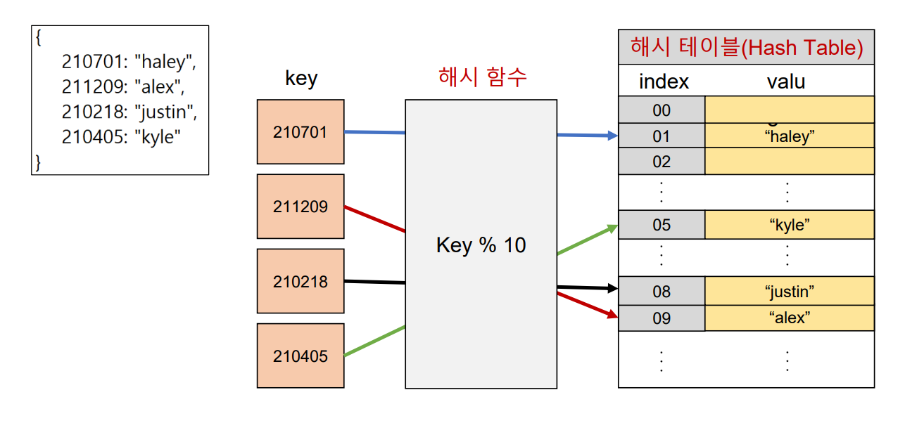

# 해시 테이블
> 해시함수를 사용하여 변환한 값을 인덱스로 삼아 키(key)와 값(value)를 저장하는 자료구조
> 파이썬에는 **딕셔너리 자료구조가 내장**되어 있다!

만약 리스트를 이용하여 Key: Value를 저장한다면 탐색을 할 때 순차적으로 탐색하므로 시간이 오래 걸린다.
하지만 딕셔너리는 **해시 테이블**을 이용하여 키와 값을 저장하므로 시간이 단축된다.

- **해시 함수**: 임의 길이의 데이터를 고정 길이의 데이터로 매핑하는 함수
- **해시**: 해시 함수를 통해 얻어진 값

따라서 파이썬의 딕셔너리는 해시 함수와 해시 테이블을 이용하기 때문에 삽입, 삭제, 수정 조회 **연산의 속도가 리스트보다 빠르다**

# 딕셔너리 기본 문법
## 선언
> `변수 = {key1: value1, key2: value2 … }`
```python
a = {
    'name': 'kyle',
    'gender': 'male',
    'address': 'Seoul'
}

print(a)
# {'name': 'kyle', 'gender': 'male', 'address': 'Seoul'}
```

## 삽입/ 수정
> `딕셔너리[key] = value`
> 내부에 해당 key가 없으면 삽입, 있으면 수정

### 삽입
```python
a = {
    'name': 'kyle',
    'gender': 'male',
    'address': 'Seoul'
}

# 'job'이라는 key가 없으므로 삽입
a['job'] = 'coach'
print(a)
# {'name': 'kyle', 'gender': 'male', 'address': 'Seoul', 'job': 'coach'}
```

### 수정
```python
a = {
    'name': 'kyle',
    'gender': 'male',
    'address': 'Seoul'
}

# 'name' key가 있으므로 수정
a['name'] = 'justin'
print(a)
# {'name': 'justin', 'gender': 'male', 'address': 'Seoul'}
```

## 삭제
> `딕셔너리.pop(key)`
> 내부에 존재하는 key에 대한 value 삭제 및 반환, 존재하지 않는 key에 대해서는 KeyError 발생

### key가 존재할 때
```python
a = {
    'name': 'kyle',
    'gender': 'male',
    'address': 'Seoul'
}

# key가 딕셔너리 내부에 존재하므로 삭제한 후 값 반환
gender = a.pop('gender')
print(a)
print(gender)
# {'name': 'kyle', 'address': 'Seoul'}
# male
```

### key가 존재하지 않을 때
```python
a = {
    'name': 'kyle',
    'gender': 'male',
    'address': 'Seoul'
}

# key가 존재하지 않을 때
phone = a.pop('phone')
print(a)
print(phone)
# KeyError!!
```
### key가 존재하지 않을 때 - default값 설정
> `딕셔너리.pop(key, default)`
> 두 번째 인자로 default(기본)값을 지정하여 KeyError 방지 가능
```python
a = {
    'name': 'kyle',
    'gender': 'male',
    'address': 'Seoul'
}

phone = a.pop('phone', '010-1234-5678')
print(a)
print(phone)
# {'name': 'kyle', 'gender': 'male', 'address': 'Seoul'}
# 010-1234-5678
```

## 조회
> `딕셔너리[key]` 혹은 `딕셔너리.get(key)`
> key에 해당하는 value 반환

### 딕셔너리[key]
```python
a = {
    'name': 'kyle',
    'gender': 'male',
    'address': 'Seoul'
}

print(a['name'])
# kyle

print(a['phone'])
# KeyError!!
# 딕셔너리[key]를 사용하면 찾고자 하는 key가 없을 때 에러 발생
```

### 딕셔너리.get(key)
```python
a = {
    'name': 'kyle',
    'gender': 'male',
    'address': 'Seoul'
}

print(a.get('name'))
# kyle

print(a['phone'])
# None
# 딕셔너리.get(key)를 이용하면 찾고자 하는 key값이 없으면 default값으로 None을 반환

print(a['phone', '없음'])
# 없음
# default값을 두 번째 인자로 직접 정해주면 key값이 없을 때 반환
```

# 딕셔너리 메소드
## .keys()
> 딕셔너리의 **key 목록**이 담긴 dict_keys 객체 반환
```python
a = {
    'name': 'kyle',
    'gender': 'male',
    'address': 'Seoul'
}
print(a.keys())
# dict_keys(['name', 'gender', 'address'])
```
```python
a = {
    'name': 'kyle',
    'gender': 'male',
    'address': 'Seoul'
}
for key in a.keys():
    print(key)
# name
# gender
# address
```
```python
a = {
    'name': 'kyle',
    'gender': 'male',
    'address': 'Seoul'
}
for key in a:
    print(key)
# name
# gender
# address
```

## .values()
> 딕셔너리의 **value 목록**이 담긴 dict_values 객체 반환
```python
a = {
    'name': 'kyle',
    'gender': 'male',
    'address': 'Seoul'
}
print(a.values())
# dict_values(['kyle', 'male', 'Seoul'])
```
```python
a = {
    'name': 'kyle',
    'gender': 'male',
    'address': 'Seoul'
}
for value in a.values():
    print(value)
# kyle
# male
# Seoul
```

## .items()
> 딕셔너리의 **(key, value) 쌍 목록**이 담긴 dict_items 객체 반환
```python
a = {
    'name': 'kyle',
    'gender': 'male',
    'address': 'Seoul'
}
print(a.items())
# dict_items([('name', 'kyle'), ('gender', 'male'), ('address', 'Seoul')])
```
```python
a = {
    'name': 'kyle',
    'gender': 'male',
    'address': 'Seoul'
}
for items in a.items():
    print(item)
# ('name', 'kyle')
# ('gender', 'male')
# ('address', 'Seoul')
```
```python
a = {
    'name': 'kyle',
    'gender': 'male',
    'address': 'Seoul'
}
for key, value in a.items():
    print(key, value)
# name, kyle
# gender, male
# address, Seoul
```